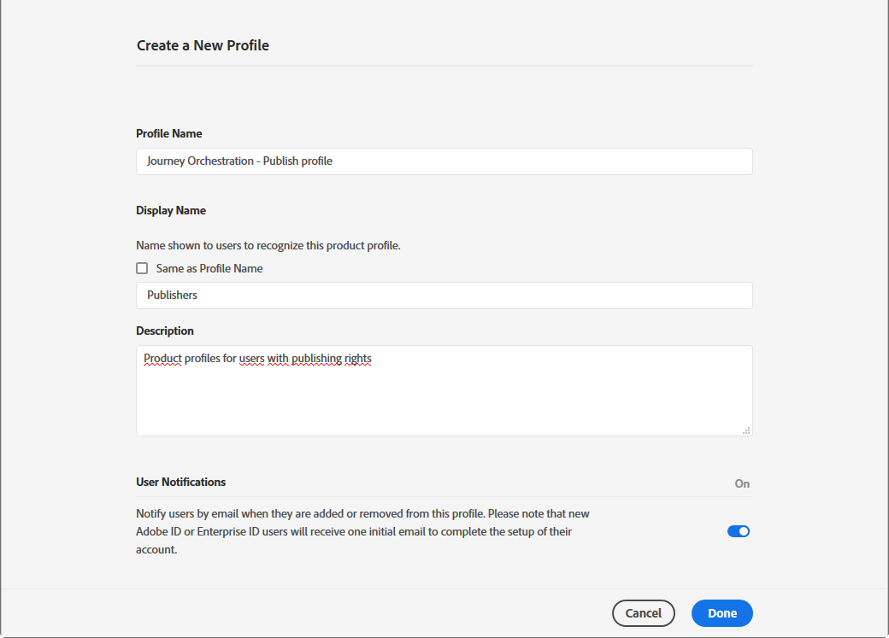

# Access management{#concept_rfj_wpt_52b}

## About access management {#about-access-management}

Journey orchestration allows you to assign a set of rights and sandboxes to your users to define which part of the interface they can access.

They can be managed by Administrators that have access the Admin console. For more information on the Admin console, refer to this documentation.

In the Admin console, you can assign one of the following out-of-the-box product profiles to your users:

*   **[!UICONTROL Limited Access User]**: user with read-only access to journeys and reports. This product profile includes the following rights:
    *   Read journeys
    *   Read reports

*   **[!UICONTROL Administrators]**: user with access to the administration menus with the possibility to manage journeys, events and reports. This product profile includes the following rights:
    *   Manage journeys
    *   Publish journeys
    *   Manage events, data sources and actions
    *   Manage reports

    >[!NOTE]
    >
    >**[!UICONTROL Administrators]** is the only product profile which allows creation, edition and publication of transactional messaging (or messaging templates) in Adobe Campaign Standard. This product profile is needed if you use Adobe Campaign Standard to send messages in your journeys.

*   **[!UICONTROL Standard User]**: user with basic access such as journey management. This product profile includes the following rights:
    *   Manage journeys
    *   Publish journeys
    *   Manage reports

You can also create your own product profiles if the out-of-the-box profiles are not enough to manage your users.
Users must always be linked to a product profile allowing you to assign them specific build-in rights such as:

*   **[!UICONTROL Read journeys]**
*   **[!UICONTROL Read reports]**
*   **[!UICONTROL Manage events, data sources and actions]**
*   **[!UICONTROL Read events, data sources and actions]**
*   **[!UICONTROL Manage journeys]**
*   **[!UICONTROL Publish journeys]**
*   **[!UICONTROL Manage reports]**

You can find below the compatibility between rights and Journey Orchestration's different functionalities.

## Creating a product profile {#create-product-profile}

Journey Orchestration allows you to create your own product profiles and assign a set of rights and sandboxes to your users. With product profiles, you can authorize or deny access to certain functionalities or objects in the interface.

For more information on how to create and manage sandboxes, refer to [Adobe Experience Platform documentation](https://docs.adobe.com/content/help/en/experience-platform/sandbox/ui/user-guide.html).

To create a product profile and assign a set of rights and sandboxes:

1. In the Admin Console, select **[!UICONTROL Journey orchestration]**. From the **[!UICONTROL Product profile]** tab, click **[!UICONTROL New Profile]**.

    

1. Add a **[!UICONTROL Profile Name]** and **[!UICONTROL Description]** for your new product profile. If you want your profile's **[!UICONTROL Display name]** to be different, uncheck **[!UICONTROL Same as Profile Name]** and type in your **[!UICONTROL Display name]**.

1. In the **[!UICONTROL User Notifications]** category, choose whether users will be notified by email when they are added or removed from this product profile.

1. When finished, click **[!UICONTROL Done]**. Your new product profile is now created.

    

1. Select your new product profile to start managing permissions. In the **[!UICONTROL Users]** tab, add users to your product profile. For more on this, refer to this [page](../about/access-management.md#assigning-product-profile).

1. Carry out the same steps as detailed above to add **[!UICONTROL Admin]** to your product profile.

1. From the **[!UICONTROL Permissions]** tab, select one of the two categories **[!UICONTROL Sandbox]** or **[!UICONTROL Authoring]** to open the **[!UICONTROL Edit Permissions]** page and add or remove permissions for your product profile.

    

1. In the **[!UICONTROL Sandbox]** permission category, choose which sandbox(es) to assign to your product profile. Under **[!UICONTROL Available Permissions Items]**, click the plus (+) icon to assign sandboxes to your profile.

    

1. If needed, under **[!UICONTROL Included Permission Items]**, click the X icon next to remove permissions to your product profile.

    

1. From the **[!UICONTROL Authoring]** permission category, carry out the same steps as above to add rights to your product profile.
 For more information on rights and compatibility between rights and Journey Orchestration's different functionalities, refer to this [section](../about/access-management.md#about-access-management).

    

1. When finished, click **[!UICONTROL Save]**.

Your product profile is now created and configured. Users linked to this profile can now connect to Journey orchestration.

## Assigning a product profile {#assigning-product-profile}

Product profiles are assigned to a set of users that share the same rights within your organization.
The list of every out-of-the-box product profiles with assigned rights can be found in this section.

To assign a product profile for a user to access Journey Orchestration:

1. In the Admin Console, select **[!UICONTROL Journey orchestration]**.

    

1. Select the product profile to which your new user will be linked to.

    

1. Click **[!UICONTROL Add user]**.
   
   You can also add your new user to a user group to fine-tune the shared set of permissions. For more on this, refer to this [page](https://helpx.adobe.com/enterprise/using/user-groups.html).

    

1. Type in the email address of your new user then click **[!UICONTROL Save]**.

    

Your user should then receive an email redirecting to your Journey Orchestration instance.