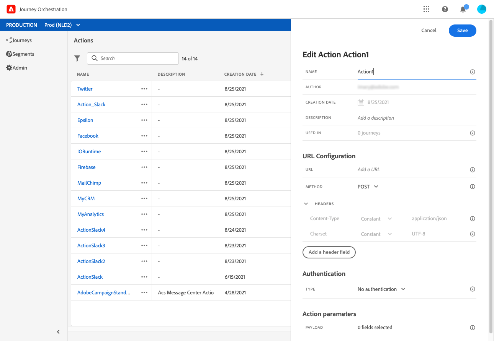

# Get started{#concept_y4b_4qt_52b}

In [!DNL Journey Orchestration], there are two types of users, each of them performing specific tasks: the **technical user** and the **business user**. User access is managed via product profiles and rights. Refer to [this page](../about/access-management.md) to learn how to configure user access.

Here are the main steps to configure and use [!DNL Journey Orchestration]:

1. **Configure an event**

    You need to define the expected information and how to process it. This configuration is mandatory. This step is performed by a **technical user**.

    For more on this, refer to [this page](../event/about-events.md).

      

1. **Configure the data source**

    You need to define a connection to a system to retrieve additional information that will be used in your journeys, for example in your conditions. A built-in Adobe Experience Platform data source is also configured at provisioning time. This step is not required if you only leverage data from the events in your journey. This step is performed by a **technical user**.

    For more on this, refer to [this page](../datasource/about-data-sources.md).
    
      

1. **Configure an action**

    If you're using a third-party system to send your messages, you need to configure its connection with [!DNL Journey Orchestration]. See [this page](../action/about-custom-action-configuration.md).

    If you are using Adobe Campaign Standard to send messages, you need to configure the built-in action. See [this page](../action/working-with-adobe-campaign.md). 

    These steps are performed by a **technical user**.

      

1. **Design your journey**

     Combine the different event, orchestration and action activities to build your multi-step cross-channel scenarios. This step is performed by a **business user**.

     For more on this, see [this page](../building-journeys/journey.md).

     

1. **Test and publish the journey**

    You need to validate and activate the journey. This step is performed by a **business user**.

    For more on this, see the pages [Testing the journey](../building-journeys/testing-the-journey.md) and [Publishing the journey](../building-journeys/publishing-the-journey.md).

    

1. **Monitor your journey**

    Use the dedicated reporting tools to measure your journey's effectiveness. This step is performed by a **business user**.

    For more on this, see [this page](../reporting/about-journey-reports.md).

    
