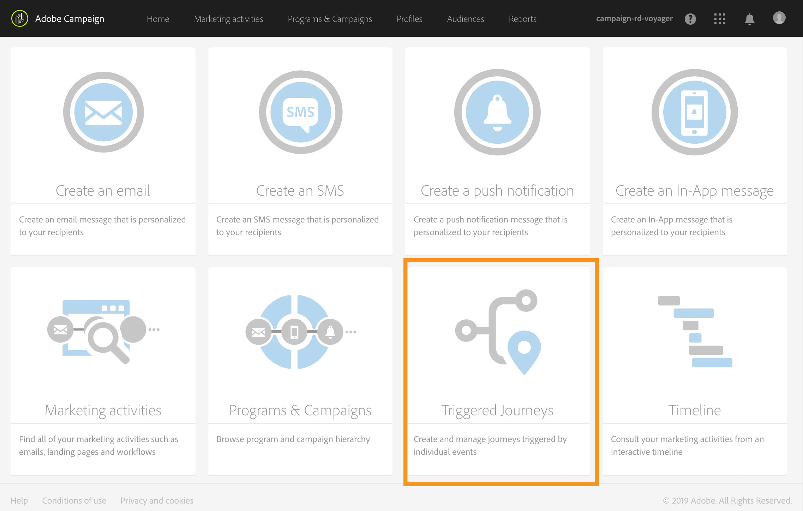
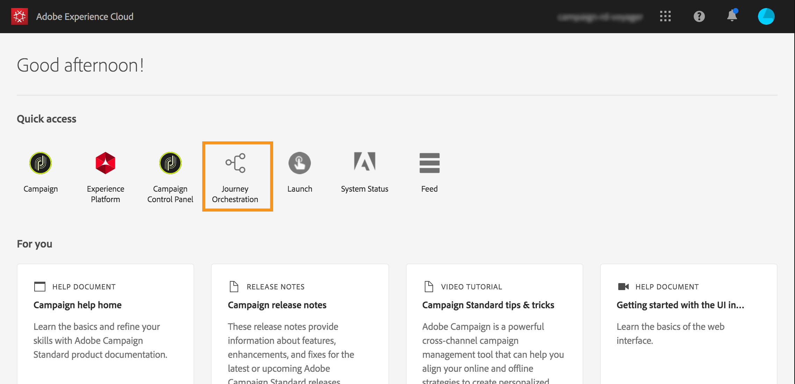
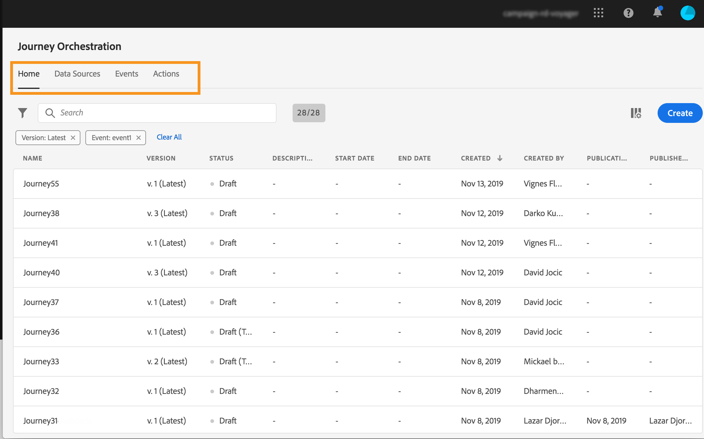
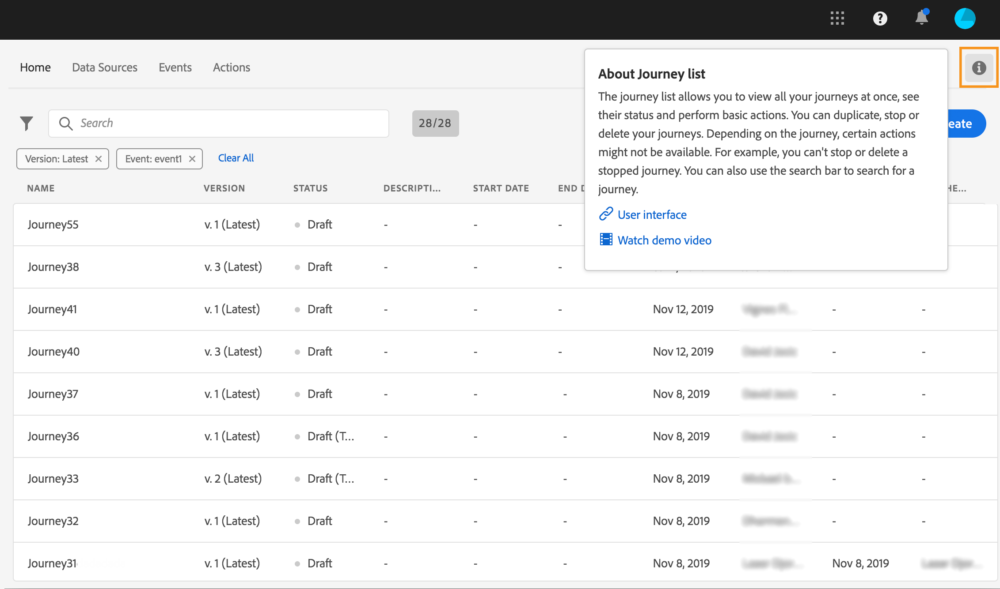
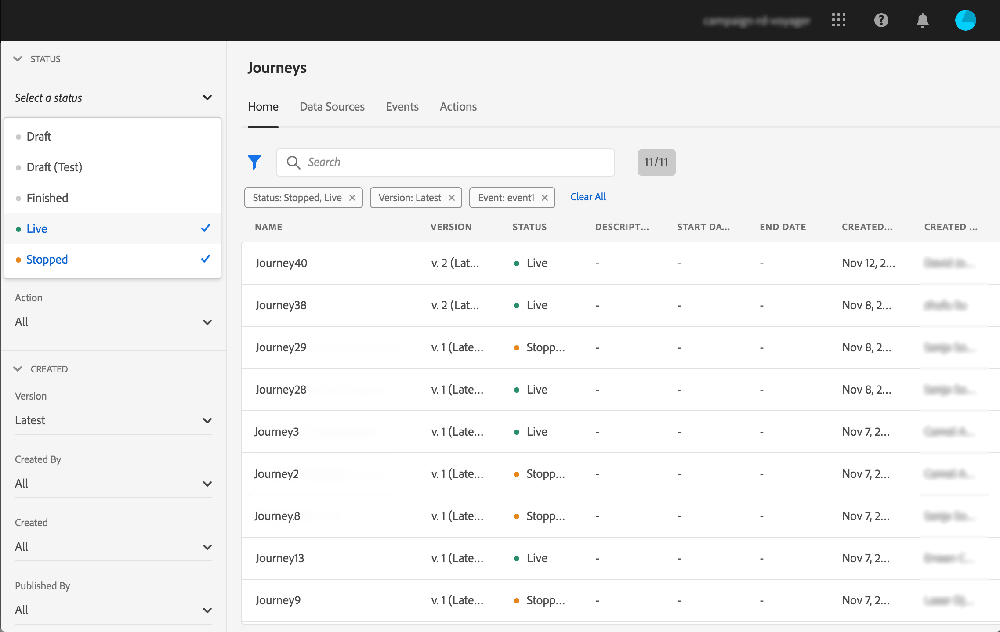
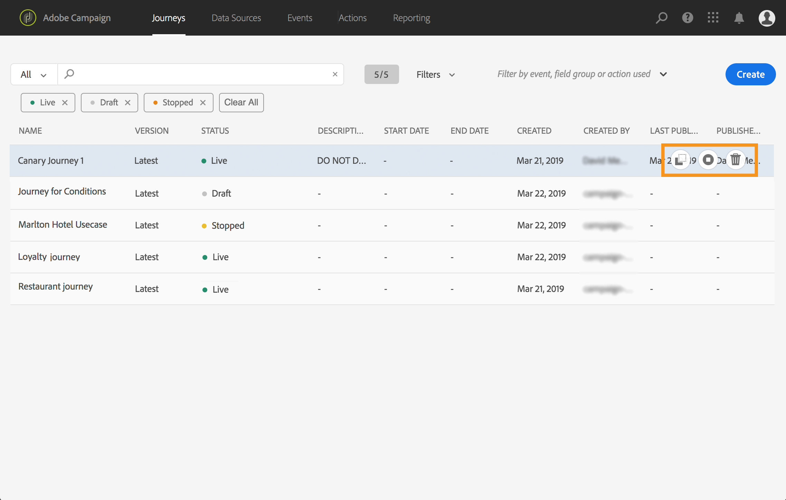

# User interface{#concept_rcq_lqt_52b}

>[!NOTE]
>
>To get the best out of [!DNL Journey Orchestration], we recommend using Chrome as your Internet browser. The interface is displayed in the language defined in IMS. If your IMS language is not supported by [!DNL Journey Orchestration], the interface is displayed in English. 
>
>This documentation is frequently updated to reflect recent changes in the product. However, some screenshots can slightly differ from the product's interface.

## Accessing [!DNL Journey Orchestration]{#accessing_journey_orchestration}

To access the [!DNL Journey Orchestration]'s interface, click the **[!UICONTROL App Selector]** icon, in the top right, then click **[!UICONTROL Journey Orchestration]**.

  

You can also access [!DNL Journey Orchestration] from the Experience Cloud home page, in the **[!UICONTROL Quick access]** section.

  

## Discovering the interface{#section_jsq_zr1_ffb}

>[!CONTEXTUALHELP]
>id="jo_home"
>title="About Journey list"
>abstract="The journey list allows you to view all your journeys at once, see their status and perform basic actions."
>additional-url="https://images-tv.adobe.com/mpcv3/38af62cb-9390-4bc0-a576-d336849adb97_1574809570.1920x1080at3000_h264.mp4" text="Watch demo video"

The top menus allow you to navigate through the different functionalities of [!DNL Journey Orchestration]: **[!UICONTROL Home]**(the journeys),**[!UICONTROL Data Sources]**, **[!UICONTROL Events]**, **[!UICONTROL Actions]**.

  

Click the  icon in the upper-right corner of the screen to display the contextual help. It is available across the different [!DNL Journey Orchestration] list screens (journeys, events, actions and data sources). This allows you to view a quick description of the current functionality and access related articles and videos. 

  

## Searching and filtering{#section_lgm_hpz_pgb}

In the **[!UICONTROL Home]**,**[!UICONTROL Data Sources]**, **[!UICONTROL Events]** and **[!UICONTROL Actions]** lists, a search bar allows you to search for an item.

The **[!UICONTROL Filters]** can be accessed by clicking on the filter icon on the top left of the list. The filters menu allows you to filter the displayed elements according to different criteria. You can choose to only display the elements of a certain type or status, the ones you created, or the ones modified in the last 30 days.

In the **[!UICONTROL Data Sources]**, **[!UICONTROL Events]** and **[!UICONTROL Actions]** lists, use the **[!UICONTROL Creation filters]** to filter on the creation date and user. You can choose, for example, to only display the events that you created in the past 30 days.

In the journey list (under **[!UICONTROL Home]**), in addition to the **[!UICONTROL Creation filters]**, you can also filter the displayed journeys according to their status, type and version (**[!UICONTROL Status and version filters]**). The type can be: **[!UICONTROL Unitary event]** or **[!UICONTROL Segment qualification]**. You can also choose to only display the journeys that use a particular event, field group or action (**[!UICONTROL Activity filters]** and **[!UICONTROL Data filters]**).The **[!UICONTROL Publication filters]** let you select a publication date or user. You can choose, for example, to only display the latest versions of live journeys that were published yesterday. See [this page](../building-journeys/using-the-journey-designer.md).

>[!NOTE]
>
>Note that columns displayed can be personalized using the configuration button on the top right of the lists. Personalization is saved for each user.

The **[!UICONTROL Last update]** and **[!UICONTROL Last update by]** columns allow you to display when has the last update of your journeys occured and which user operated it.

In the event, data source and action configuration panes, the **[!UICONTROL Used in]** field displays the number of journeys that use that particular event, field group or action. You can click the **[!UICONTROL View journeys]** button to display the list of corresponding journeys.

In the different lists, you can perform basic actions on each element. For example, you can duplicate or delete an item.

## Browsing through Adobe Experience Platform fields {#friendly-names-display}

When defining [event payload](../event/defining-the-payload-fields.md), [field group payload](../datasource/field-groups.md) and selecting fields in the [expression editor](../expression/expressionadvanced.md), the display name is displayed in addition to the field name. This information is retrieved from the schema definition in the Experience Data Model.

If descriptors such as "xdm:alternateDisplayInfo" are provided while setting up schemas, the user-friendly names will replace display names. It is especially useful when working with “eVars” and generic fields.You can configure friendly name descriptors via an API call. For more information, see the [Schema Registry developer guide](https://experienceleague.adobe.com/docs/experience-platform/xdm/api/getting-started.html).

 

If a friendly name is available, then the field will be displayed as `<friendly-name>(<name>)`. If no friendly name is available, the display name will appear, for example `<display-name>(<name>)`. If none of them are defined, only the technical name of the field will be displayed `<name>`.

>[!NOTE]
>
>Friendly names are not retrieved when you select fields from a union of schemas.

## Accessibility{#accessibility}

The accessibility features in Adobe Journey Optimizer are provided by Adobe Experience Platform:

* Keyboard accessibility
* Color contrast
* Validation of required fields

[Learn more](https://experienceleague.adobe.com/docs/experience-platform/accessibility/features.html){target="_blank"} in Adobe Experience Platform documentation.

You can use these common keyboard shortcuts in Adobe Journey Optimizer:

| Action | Shortcut |
| --- | --- |
| Move between user interface elements, sections, and menu groups | Tab |
| Move backward between user interface elements, sections, and menu groups | Shift + Tab |
| Move within sections to set focus to individual elements | Arrow |
| Select or clear an element that is in focus | Enter or Spacebar |
| Cancel a selection, collapse a panel, or close a dialog box | Esc |

[Learn more](https://experienceleague.adobe.com/docs/experience-platform/accessibility/custom.html){target="_blank"} in Adobe Experience Platform documentation.

You can use these shortcuts in specific parts of Journey Optimizer:

<table>
  <thead>
    <tr>
      <th>Interface element</th>
      <th>Action</th>
      <th>Shortcut</th>
    </tr>
  </thead>
  <tr>
    <td>List of journeys, actions, data sources, or events</td>
    <td>Create a journey, an action, a data source, or an event</td>
    <td>C</td>
  </tr>
  <tr>
    <td rowspan="3">Journey canvas in draft status</td>
    <td>Add an activity from the left palette at the first available position, from top to bottom</td>
    <td>Double-click on the activity</td>
  </tr>
  <tr>
    <td>Select all the activities</td>
    <td>Ctrl + A (Windows) Command + A (Mac)</td>
  </tr>
  <tr>
    <td>Delete the selected activities</td>
    <td>Delete or Backspace, then Enter to confirm the deletion</td>
  </tr>
  <tr>
  <td rowspan="3">
  
  Configuration pane of these elements:

<ul>
  <li>Activity in a journey</li>
  <li>Event</li>
  <li>Data source</li>
  <li>Action</li>
</ul>

  </td>
    <td>Move to the next field to be configured</td>
    <td>Tab</td>
  </tr>
  <tr>
    <td>Save changes and close the configuration pane</td>
    <td>Enter</td>
  </tr>
  <tr>
    <td>Discard changes and close the configuration pane</td>
    <td>Esc</td>
  </tr>
  <tr>
    <td rowspan="4">Journey in test mode</td>
    <td>Enable or disable the test mode</td>
    <td>T</td>
  </tr>
  <tr>
    <td>Trigger an event in an event-based journey</td>
    <td>E</td>
  </tr>
  <tr>
    <td>

  Trigger an event in a segment-based journey for which the **[!UICONTROL Single profile at a time]** option is turned on

  </td>
    <td>P</td>
  </tr>
  <tr>
    <td>Display the test logs</td>
    <td>L</td>
  </tr>
<!-- //Ajouter ce raccourci quand il marchera (actuellement, le raccourci Ctrl/Cmd+F du navigateur a priorité sur celui de AJO).//
  <tr>
    <td>Page with a search bar</td>
    <td>Select the search bar</td>
    <td>Ctrl/Command + F</td>
  </tr>
-->
  <tr>
    <td>Text field</td>
    <td>Select all the text in the selected field</td>
    <td>Ctrl + A (Windows) Command + A (Mac)</td>
  </tr>
  <tr>
    <td rowspan="2">Pop-up window</td>
    <td>Save changes or confirm the action</td>
    <td>Enter</td>
  </tr>
  <tr>
    <td>Close the window</td>
    <td>Esc</td>
  </tr>
  <tr>
    <td>Simple expression editor</td>
    <td>Select and add a field</td>
    <td>Double-click on a field</td>
  </tr>
  <tr>
    <td>Browsing through XDM fields</td>
    <td>Select all the fields of a node</td>
    <td>Select the parent node</td>
  </tr>
  <tr>
    <td>Payload preview</td>
    <td>Select the payload</td>
    <td>Ctrl + A (Windows) Command + A (Mac)</td>
  </tr>
</table>
