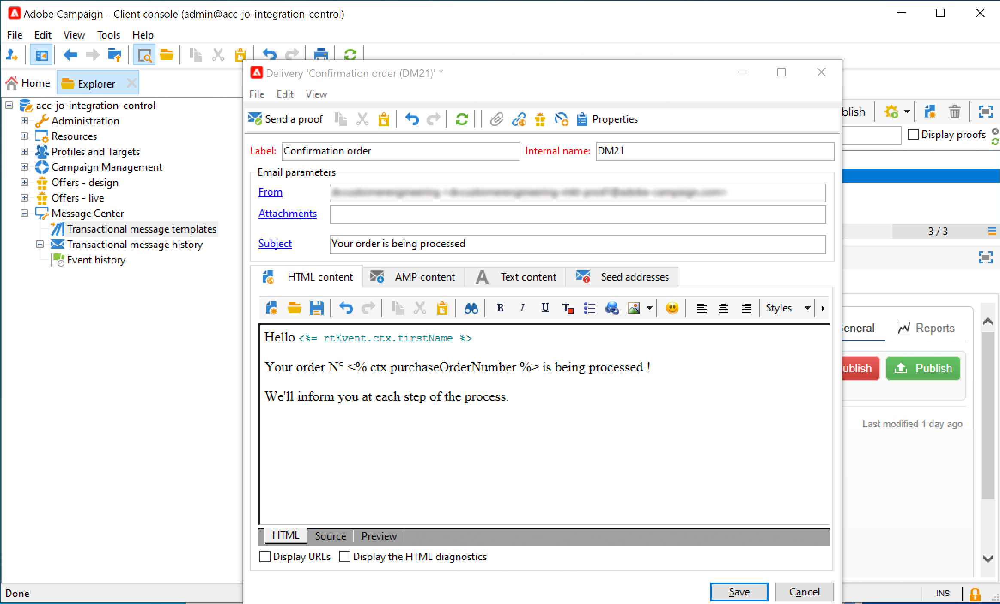

# Integrating with Adobe Campaign Classic {#integrating-with-adobe-campaign-classic}

This integration allows you to send emails, push notifications and SMS using Adobe Campaign Classic Transactional Messaging capabilities.

The connection between the Journey Orchestration and Campaign Classic instances is setup by Adobe at provisioning time.

## Important notes

* There is no throttling of messages. We cap the number of messages that can be sent over to 50,000/hour based on our current Campaign Classic SLA. For this reason, Journey orchestration should only be used in unitary use cases (individual events, not segments).

* You need to configure one action on the canvas per template you wish to use. You need to configure one action in Journey Orchestration for each template you wish to use from Adobe Campaign Classic.

* We recommend that you use a dedicated Message Center instance that is hosted for this integration to avoid impacting any other Campaign Classic operations that you may have going on. The marketing server can be hosted or on-premise. The build required is 21.1 Release Candidate or greater. 

* There is no validation that the payload or Campaign Classic message is correct.

* You cannot use a Campaign Classic action with a segment qualification event.

## Prerequisites

In Campaign Classic, you need to create and publish a transactional message and its associated event. Refer to the [Adobe Campaign Classic documentation](https://experienceleague.adobe.com/docs/campaign-classic/using/transactional-messaging/introduction/about-transactional-messaging.html#transactional-messaging).

You can build your JSON payload corresponding to each message following the pattern below. You will then paste this payload when configuring the action in Journey Orchestration (see below)

Here is an example:

```
{
    "channel": "email",
    "eventType": "welcome",
    "email": "example@adobe.com",
    "ctx": {
        "firstName": "John"
    }
}
```

* **channel**: the channel defined for your Campaign Classic transactional template
* **eventType**: the internal name of your Campaign Classic event
* **ctx**: variable based on the personalization you have in your message. 

## Configuring the action

In Journey Orchestration, you need to configure one action per transactional message. Follow these steps:

1. Create a new action. Refer to this [section](../action/action.md).
1. Enter a name and description.
1. In the **Action type** field, select **Adobe Campaign Classic**.
1. Click in the **Payload** field and paste an example of the JSON payload corresponding to the Campaign Classic message. Contact Adobe to get this payload.
1. Adjust the different fields to be static or variable depending on if you want to map them on the Journey canvas. Certain fields, such as channel parameters for email address and personalization fields (ctx), you likely want defined as variables for mapping in context of the journey.
1. Click **Save**.


For each action configured, an action activity is available in the journey designer palette.

## Adding a message in a journey

1. Design your journey, starting with an event. See this [section](../building-journeys/journey.md).
1. In the **Action** section of the palette, select a Campaign Classic action and add it to your journey.
1. In the **Action parameters**, all the fields expected in the message payload are displayed. You need to map each of these fields with the field you want to use, either from the event or from the data source. This is similar to custom actions. Refer to this [section](../building-journeys/using-custom-actions.md).


## Use case

This use case presents all the steps needed to send an email using the Adobe Campaign Classic integration. 
We will first create a transactional email template in Campaign Classic. Then, in Journey Orchestration, we'll create the action and design the journey.

**Adobe Campaign Classic**

Your Campaign Classic instance needs to be provisionned for this integration. The Transactional Messaging feature needs to be configured.

1. Log in to your Campaign Classic control instance. 

1. Under **Administration** > **Platform** > **Enumerations**, select the **Event type** (eventType) enumeration. Create a new event type ("journey-event", in our example). You will have to use the internal name of the event type when writing the JSON file. 

    

1. Disconnect and reconnect to the instance for the creation to be effective.

1. Under **Message Center** > **Transactional message templates**, create a new email template based on the event type previously created.

    

1. Design your template. In this example, we use personalization on the profile's first name and the order number. The first name is in the Adobe Experience Platform data source, and the order number is a field from our Journey Orchestration event. Make sure you use the correct field names in Campaign Classic. 

    

1. Publish your transactional template.

    

1. Now you need to write the JSON payload corresponding the template. 

```
{
     "channel": "email",
     "eventType": "journey-event",
     "email": "Email address",
     "ctx": {
          "firstName": "First name", "purchaseOrderNumber": "Purchase order number"
     }
}
```

    * For the channel, you need to type "email".
    * For the eventType, use the internal name of the event type created previously.
    * The email address will be a variable, so you can type any label.
    * Under ctx, the personalization fields are also variables.

**Journey Orchestration**

1. First, you need to create an event. Make sure you include the "purchaseOrderNumber".

    

1. You then need to create, in Journey Orchestration, an action corresponding to your Campaign Classic template. In the **Action type** drop-down, select **Adobe Campaign Classic**. 

    

1. Click the **Payload field** and paste the JSON created previously.

    

1. For the email address and two personalization fields, change **Constant** to **Variable**.

    

1. Now create a new journey and start with the event created before.

    

1. Add the action and map each field to the correct field in Journey Orchestration. 

    

1. Add an **End** activity and test your journey.

1. You can now publish your journey.


