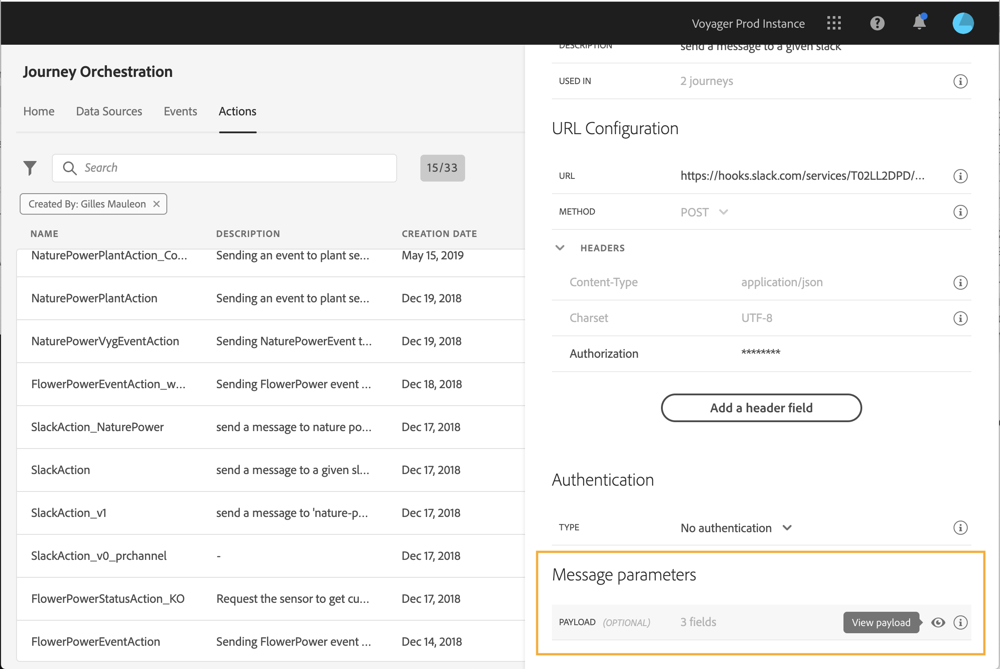
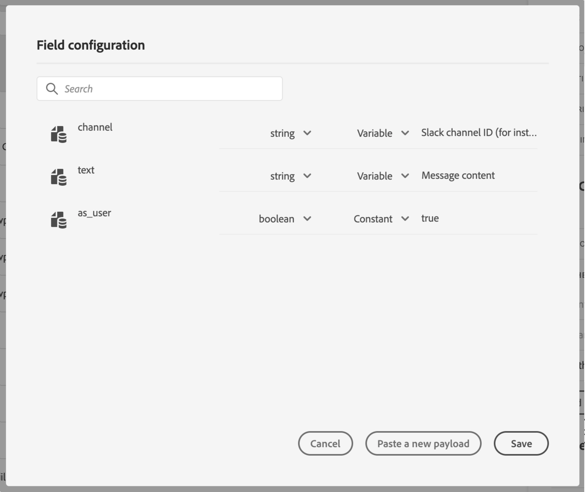

# Defining the action parameters {#concept_wy4_bf1_2gb}

>[!CAUTION]
>
>**Looking for Adobe Journey Optimizer**? Click [here](https://experienceleague.adobe.com/en/docs/journey-optimizer/using/ajo-home){target="_blank"} for Journey Optimizer documentation.
>
>
>_This documentation refers to legacy Journey Orchestration materials which has been replaced by Journey Optimizer. Please contact your account team if you have questions about your access to Journey Orchestration or Journey Optimizer._

In the **[!UICONTROL Action parameters]** section, paste an example of the JSON payload to send to the external service.

>[!NOTE]
>
>Field names in the payload cannot contain a "." character. They cannot start with a "$" character.

You will be able to define the parameter type (e.g.: string, integer, etc.).

You will also have a choice between specifying if a parameter is a constant or a variable:

* Constant means that the value of the parameter is defined in the action configuration pane by a technical persona. The value will be always the same across journeys. It will not vary and the marketer won't see it when using the custom action in the journey. It could be for example an ID the third-party system expects. In that case, the field on the right of the toggle constant/variable is the value passed.
* Variable means the value of the parameter will vary. The marketer using this custom action in a journey will be free to pass the value he wants or to specify where to retrieve the value for this parameter (e.g. from the event, from the Adobe Experience  Platform, etc.). In that case, the field on the right of the toggle constant/variable is the label the marketer will see in the journey to name this parameter.

