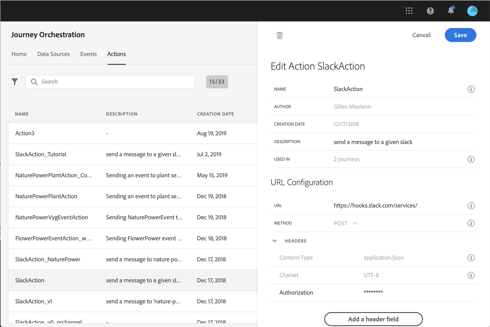

# URL configuration {#concept_gbg_1f1_2gb}

When configuring a custom action, you need to define the following **[!UICONTROL URL Configuration]** parameters:

1. In the **[!UICONTROL URL]** field, specify the URL of the external service:

    * If the URL is static, enter the URL in this field.

    * If the URL includes a dynamic path, enter only the static part of the URL, that is, the scheme, the host, the port, and, optionally, a static part of the path.

        Example: `https://xxx.yyy.com:8080/somethingstatic/`

        You will specify the dynamic path of the URL when adding the custom action to a journey. [Learn more](../building-journeys/using-custom-actions.md).

    >[!NOTE]
    >
    >For security reasons, we strongly recommend that you use the HTTPS scheme for the URL. We don't allow the use of Adobe addresses that are not public and the use of IP addresses.

1. Select the call **[!UICONTROL Method]**: it can be either **[!UICONTROL POST]** or **[!UICONTROL PUT]**.
1. In the **[!UICONTROL Headers]** section, define the HTTP headers of the request message to be sent to the external service:
   1. To add a header field, click **[!UICONTROL Add a header field]**.
   1. Enter the key of the header field.
   1. To set a dynamic value for the key-value pair, select **[!UICONTROL Variable]**. Otherwise, select **[!UICONTROL Constant]**.

        For example, for a timestamp, you can set a dynamic value.

   1. If you have selected **[!UICONTROL Constant]**, then enter the constant value.

       If you have selected **[!UICONTROL Variable]**, then you will specify this variable when adding the custom action to a journey. [Learn more](../building-journeys/using-custom-actions.md).

       

   1. To delete a header field, point to the header field and click the **[!UICONTROL Delete]** icon.

    The **[!UICONTROL Content-Type]** and **[!UICONTROL Charset]** header fields are set by default. You cannot modify or delete these fields.

    After you have added the custom action to a journey, you can still add header fields to it if the journey is in draft status. If you do not want the journey to be affected by configuration changes, duplicate the custom action and add the header fields to the new custom action.

    >[!NOTE]
    >
    >Headers are validated according to field parsing rules. [Learn more](https://tools.ietf.org/html/rfc7230#section-3.2.4).
