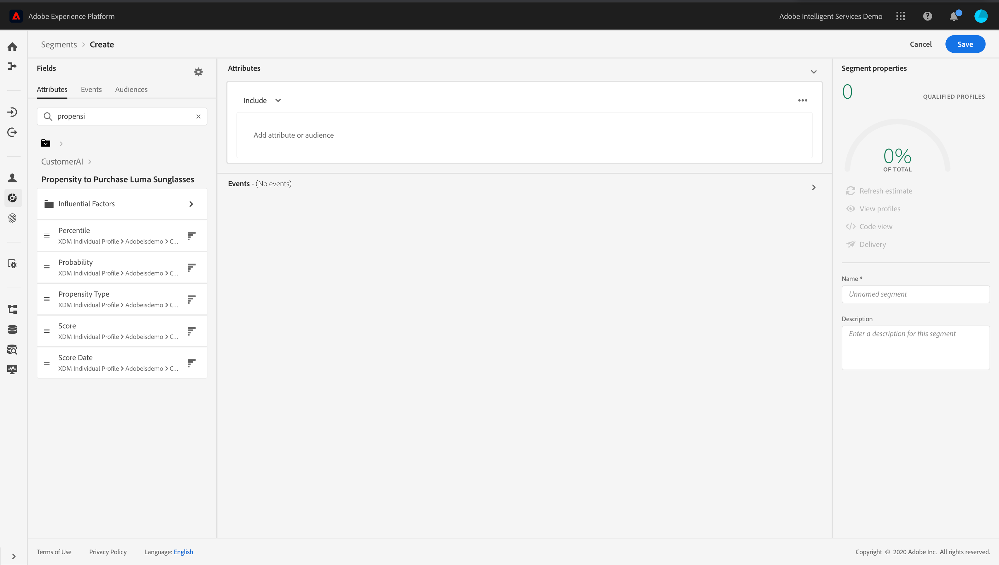

# Leveraging Customer AI {#customer-ai}

>[!CAUTION]
>
>**Looking for Adobe Journey Optimizer**? Click [here](https://experienceleague.adobe.com/en/docs/journey-optimizer/using/ajo-home){target="_blank"} for Journey Optimizer documentation.
>
>
>_This documentation refers to legacy Journey Orchestration materials which has been replaced by Journey Optimizer. Please contact your account team if you have questions about your access to Journey Orchestration or Journey Optimizer._

Customer AI is part of Intelligent Services. It helps predict what a customer is likely to do. See the [documentation](https://experienceleague.adobe.com/docs/experience-platform/intelligent-services/customer-ai/overview.html).  

Customer AI allows brands to create churn or conversion machine learning based scores that will be available as profile attributes in the Adobe Experience Platform profiles (Real-time Customer Profile).

As a result, they can be used as any other profile attributes in Journey Orchestration's conditions (to make the best decisions), actions or segment building. 

Note that Customer AI is a paid feature of the Adobe Experience Platform.
