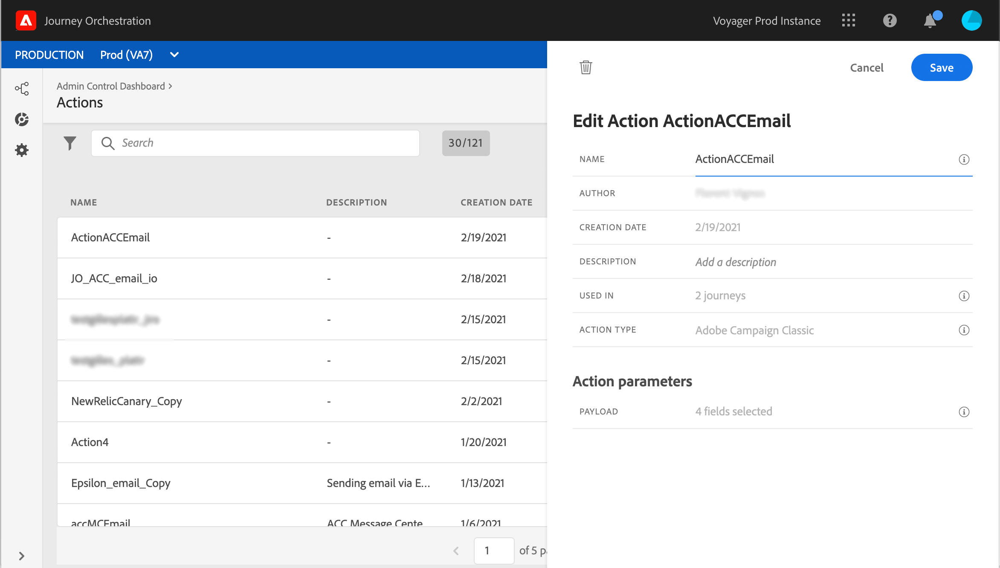

# Integrating with Adobe Campaign Classic {#integrating-with-adobe-campaign-classic}

This integration allows you to send emails, push notifications and SMS using Adobe Campaign Classic Transactional Messaging capabilities.

The connection between the Journey Orchestration and Campaign Classic instances is setup by Adobe at provisioning time.

>[!CAUTION]
>
> This integration is released as a private beta. It is not available to all Journey Orchestration customers.

## Important notes

* There is no throttling of messages. We cap the number of messages that can be sent over to 50,000/hour based on our current Campaign Classic SLA. For this reason, Journey orchestration should only be used in unitary use cases (individual events, not segments).

* You need to configure one action on the canvas per template you wish to use. 

* We recommend that you use a dedicated Message Center instance that is hosted for this integration to avoid impacting any other Campaign Classic operations that you may have going on. The marketing server can be hosted or on-premise. The build required is 21.1 Release Candidate. 

* There is no validation that the payload or Campaign Classic message is correct.

* You cannot use a Campaign Classic action with a segment qualification.

## Prerequisites

In Campaign Classic, you need to create and publish a transactional message and its associated event. Refer to the [Adobe Campaign Classic documentation](https://experienceleague.adobe.com/docs/campaign-classic/using/transactional-messaging/introduction/about-transactional-messaging.html#transactional-messaging).

Contact Adobe to get the JSON payload corresponding to each message. You will then paste this payload when configuring the action in Journey Orchestration (see below).

Here is an example:


```
{
    "channel": "email",
    "eventType": "io",
    "email": "example@adobe.com",
    "ctx": {
        "firstName": "John"
    }
}
```

Contact Adobe to get the JSON payload corresponding to each message. You will then paste this payload when configuring the action in Journey Orchestration (see below).

## Configuring the action

In Journey Orchestration, you need to configure one action per transactional message. Follow these steps:

1. Create a new action. Refer to this [section](../action/action.md).
1. Enter a name and description.
1. In the **Action type** field, select **Adobe Campaign Classic**.
1. Click in the **Payload** field and paste an example of the JSON payload corresponding to the Campaign Classic message. Contact Adobe to get this payload.
1. Click **Save**.



For each action configured, an action activity is available in the journey designer palette.

## Adding a message in a journey

1. Design your journey, starting with an event. See this [section](../building-journeys/journey.md).
1. In the **Action** section of the palette, select a Campaign Classic action and add it to your journey.
1. In the **Action parameters**, all the fields expected in the message payload are displayed. You need to map each of these fields with the field you want to use, either from the event or from the data source. This is similar to custom actions. Refer to this [section](../building-journeys/using-custom-actions.md).


