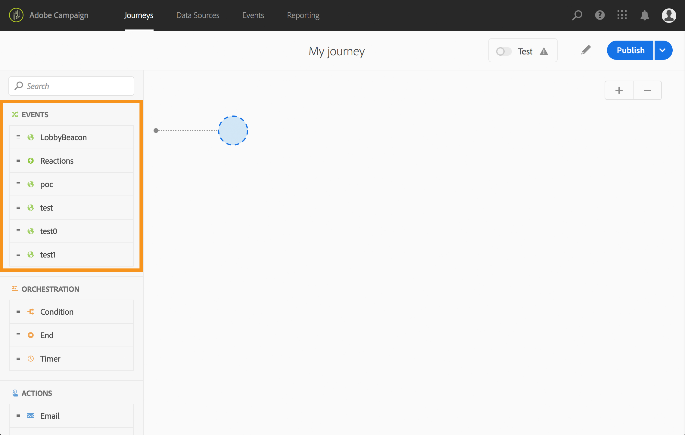
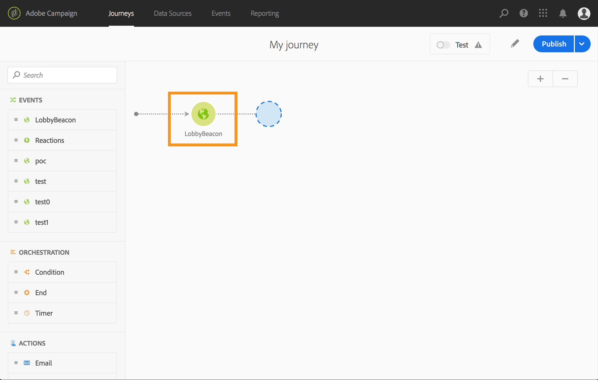

# About events activities {#concept_rws_1rt_52b}

The events configured by the technical user (see ) are all displayed in the first category of the palette, on the left side of the screen.

 

Always start your journey by drag and dropping an event activity. You can also double-click on it.

 

When you click on the event activity in the canvas, the activity configuration pane is displayed. By default, when you use the same event several times, an incremented number is added to the event name in the canvas. In addition, you can use the **[!UICONTROL Label]** field to add a suffix to the event name that will appear under your activity in the canvas. This is useful to identify your events in the canvas, especially if you use the same event several times. It will also make debugging easier in case of errors and it will make reports easier to read.

 

## Listening to events during a specific time

An event activity positioned in the journey listens to events indefinitely. To listen to an event only during a certain time, you must configure a timeout for the event.

The journey will then listen to the event during the time specified in the timeout. If an event is received during that period, the person will flow in the event path. If not, the customer will flow into a timeout path.

To configure a timeout for an event, follow these steps:

1. Activate the **[!UICONTROL Enable the event timeout]** option from the event properties.

1. Specify the amount of time the journey will wait for the event.

1. If you want to send the individuals into a timeout path when no event is received within the specified timeout, enable the **[!UICONTROL Set timeout path]** option.

    

In this example, the journey sends a first welcome push to a customer. It then sends a meal discount push only if the customer enters the restaurant within the next day. We therefore configured the restaurant event with a 1-day timeout:

* If the restaurant event is received less than 1 day hours after the welcome push, the meal discount push activity is sent.
* If no restaurant event is received within the next day, the person flows through the timeout path.
