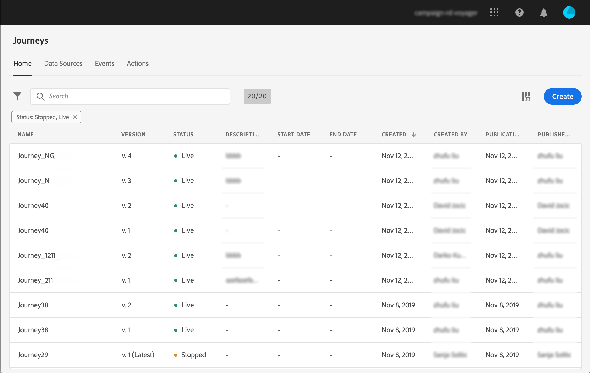
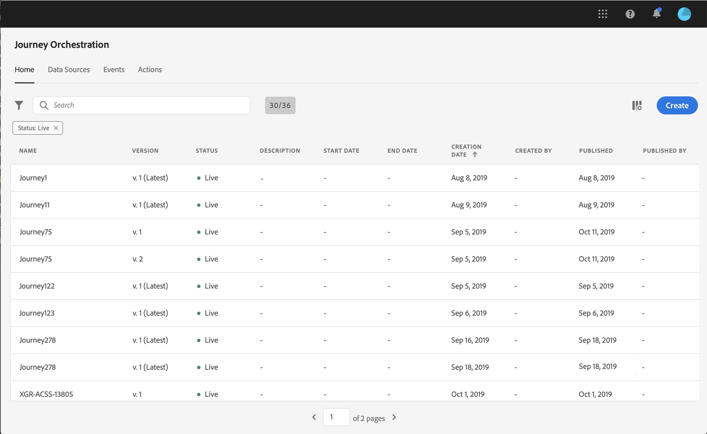
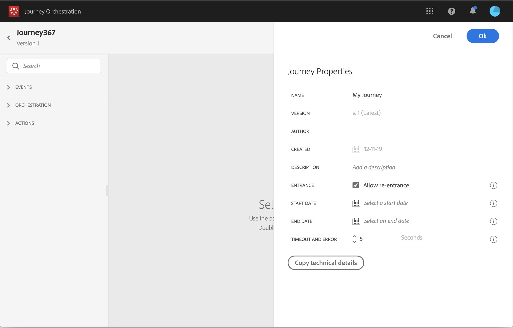
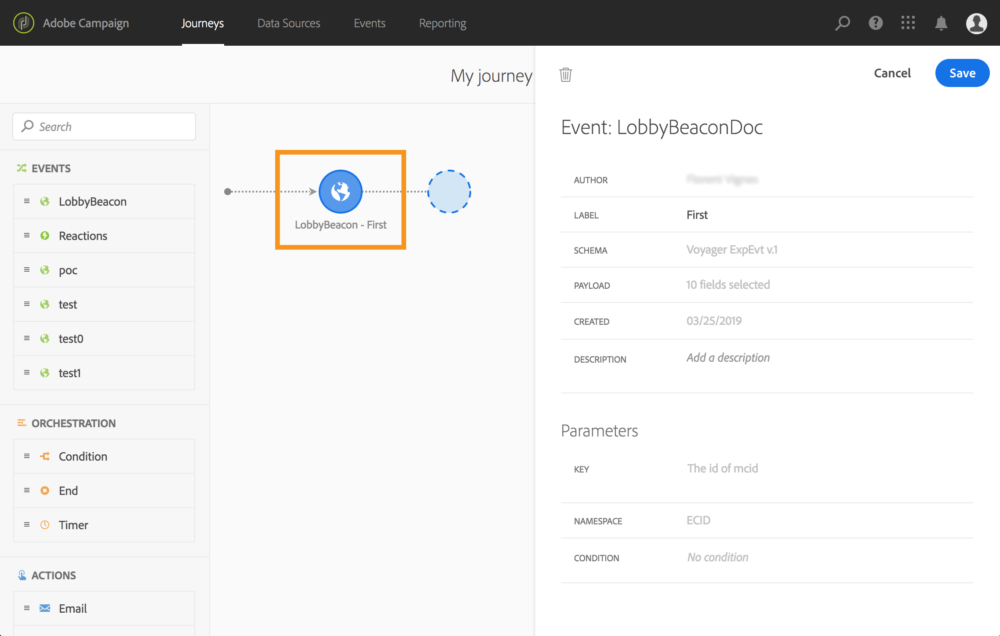
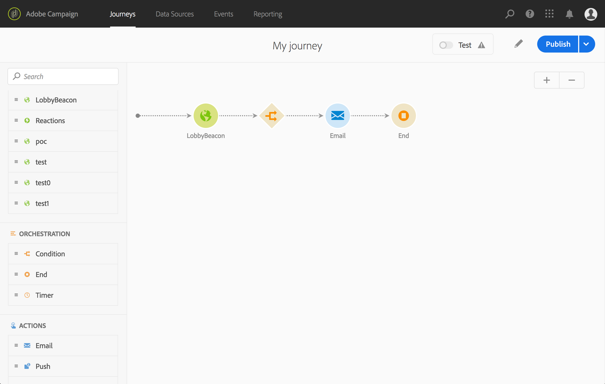
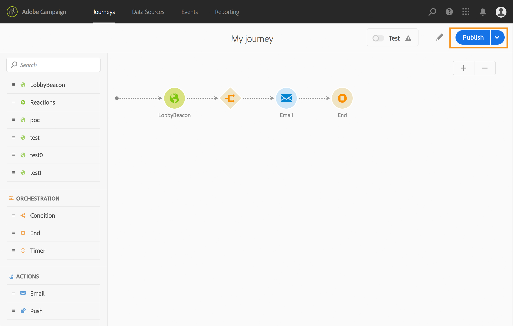

# Creating a journey {#concept_gq5_sqt_52b}

This step is performed by the **business user**. This is where you create your journeys. Combine the different event, orchestration and action activities to build your multi-step cross-channel scenarios.

The journey interface allows you to easily drag and drop activities from the palette into the canvas. You can also double-click on an activity to add it in the canvas at the next step available. Each activity has a specific role and place in the process. The activities are sequenced. When an activity is finished, the flow continues and processes the next activity, and so on.

Only one namespace is allowed per journey. When you drop the first event, events with different namespaces will be grayed out. If the first event doesn't have a namespace, then all events with a namespace will be grayed out. See [this page](../event/selecting-the-namespace.md). Also, Adobe Experience Platform field groups are grayed out if the journey has events without a namespace. And finally, if you use several events in the same journey, they need to use the same namespace.

When starting a new journey, elements that cannot be dropped in the canvas as the first step are hidden. This concerns all actions, the condition activity, the wait and the reaction.

## Quick start {#creating_journey}

Here are the main steps to create and publish a journey.

1. In the top menu, click the **[!UICONTROL Home]** tab.

    The list of journeys is displayed. Refer to [this page](../building-journeys/using-the-journey-designer.md) for more information on the interface.

    

1. Click **[!UICONTROL Create]** to create a new journey.

    

1. Edit the journey's properties in the configuration pane displayed on the right side. See [this page](../building-journeys/changing-properties.md).

    

1. Start by drag and dropping an event activity from the palette into the canvas. You can also double-click on an activity to add it to the canvas.

    

1. Drag and drop your other activities and configure them. Refer to the pages [Event activities](../building-journeys/event-activities.md), [About orchestration activities](../building-journeys/about-orchestration-activities.md) and [About action activities](../building-journeys/about-action-activities.md).

    

1. Your journey is automatically saved. Test your journey and publish it. See [testing the journey](../building-journeys/testing-the-journey.md) and [Publishing the journey](../building-journeys/publishing-the-journey.md).

    

## Ending a journey {#ending_a_journey}

A journey can end for an individual because of two reasons:

* The person arrives at the last activity of a path. This last activity can be an end activity or another activity. There is no obligation to end a path with an end activity. See [this page](../building-journeys/end-activity.md).
* The person arrives at a condition activity (or a wait activity with a condition) and does not match any of the conditions.

The person can then re-enter the journey if re-entrance is allowed. See [this page](../building-journeys/changing-properties.md).

A journey can end because of the following reasons:

* The journey is closed manually via the **[!UICONTROL Close to new entrances]** button. 
* The journey is stopped manually via the **[!UICONTROL Stop]** button.
* The journey's end date is reached.

When a journey ends (for any of the reasons above, except when using the **Stop** button), it will have the status **[!UICONTROL Closed (no entrance)]**. The journey will stop letting new individuals enter the journey. Persons already in the journey will finish the journey normally. After the default global timeout of 30 days, the journey will switch to the **Finished** status. See this [section](../building-journeys/changing-properties.md#entrance).

To learn how to close or stop a journey manually, refer to this [section](../building-journeys/terminating-a-journey.md).