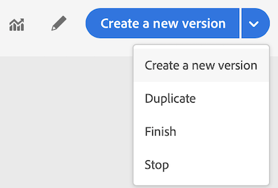

# Terminating a journey

>[!CAUTION]
>
>**Looking for Adobe Journey Optimizer**? Click [here](https://experienceleague.adobe.com/en/docs/journey-optimizer/using/ajo-home){target="_blank"} for Journey Optimizer documentation.
>
>
>_This documentation refers to legacy Journey Orchestration materials which has been replaced by Journey Optimizer. Please contact your account team if you have questions about your access to Journey Orchestration or Journey Optimizer._

The **[!UICONTROL Stop]** and **[!UICONTROL Close to new entrances]** options allow you to terminate **live** journeys. Closing a journey involves **that the arrival of new customers in the journey is blocked** and that the customers who already entered in the journey are able to experience it to the end. This is the most recommended way to put an end to a journey as it offers the best experience for customers. Stopping a journey involves that people who already entered a journey are all stopped in their progress. The journey is basically switched off.

>[!NOTE]
>
>Note that you cannot resume a closed or stopped journey.
>
>The concept of journey ending is described in this [section](../building-journeys/journey.md#ending_a_journey).

## Closing a journey

You can close a journey manually to ensure that customers who already entered the journey can finish their path but new users are not able to enter the journey.

When closed, a journey will have the status **[!UICONTROL Closed (no entrance)]**. After the default global timeout of 30 days, the journey will switch to the **Finished** status. See this [section](../building-journeys/changing-properties.md#entrance).

A closed journey version cannot be restarted or deleted. You can create a new version of it or duplicate it. Only finished journeys can be deleted.

You can close a journey by clicking **[!UICONTROL Close to new entrances]** while hovering over a journey in the list of journeys.

You can also:

1. In **[!UICONTROL Home]**, click on the journey you want to close.
1. On the top-right, click on the down arrow.

    

1. Click **[!UICONTROL Close to new entrances]**. A dialog box appears.
1. Click **[!UICONTROL Close to new entrances]** to confirm.

## Stopping a journey

You can stop a journey when an emergency occurred and all processing needs to be ended immediately on a journey.

A stopped journey version cannot be restarted.

When stopped, a journey will have the status **[!UICONTROL Stopped]**. 

You can stop a journey (for example if a marketer realizes that the journey targets the wrong audience or a custom action supposed to deliver messages is not working correctly…) by clicking **[!UICONTROL Stop]** while hovering over a journey in the list of journeys.

You can also:

1. In **[!UICONTROL Home]**, click on the journey you want to stop.
1. On the top-right, click on the down arrow.

  

1. Click **[!UICONTROL Stop]**. A dialog box appears.
1. Click **[!UICONTROL Stop]** to confirm.
