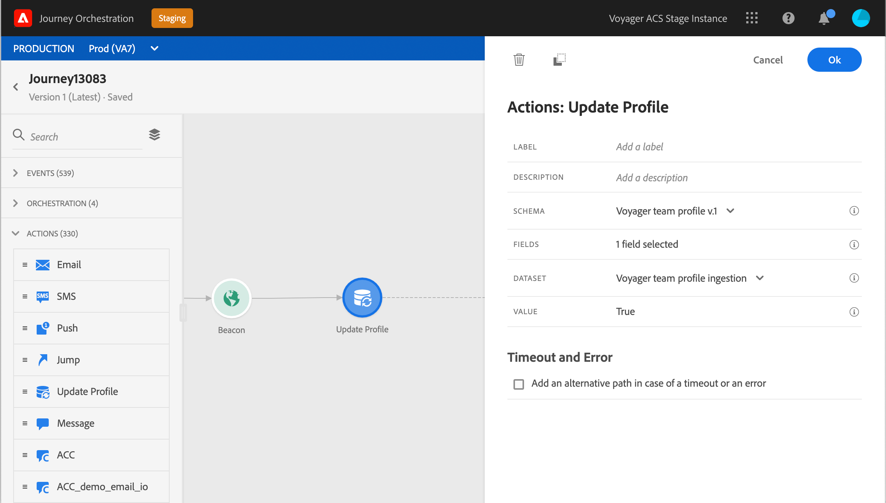

# Update profiles {#update-profile}

The **[!UICONTROL Update profile]** action activity allows you to update an existing Adobe Experience Platform profile with information coming from a journey. You will specify the field you want to update, and the value. The value can come from the event, from the data source or you can enter a value manually. 

## Important notes

* The update action can only be used in journeys starting with an event that has a namespace.
* This action has the same timeout management of other actions.
* Like any other actions, you cannot place two actions in parallel.
* In test mode, the profile update will update information on the test profile.  
* In case of errors, you can use an alternative path, just like for any errors in custom acton.
* The action does update only, no creation.

## Using the profile update

1. Design your journey by starting with an event. See this [section](../building-journeys/journey.md).
1. In the **Action** section of the palette, drop the **Update profile** activity into the canvas.
1. Select the schema and then the field you want to update in the Adobe Experience Platform profiles. Only one field can be selected. 
1. Select the dataset and then define the value you want to use. You can select a field from a data source, from the incoming event or define a specific value using the advanced expression editor.

