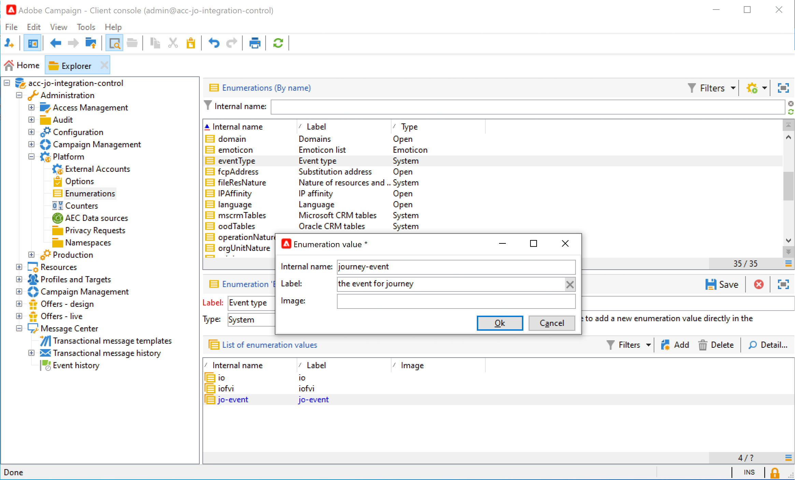
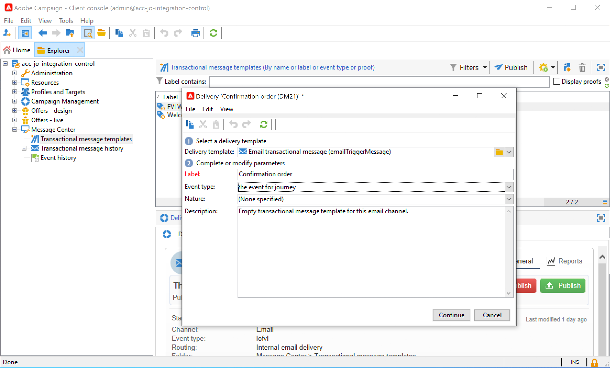
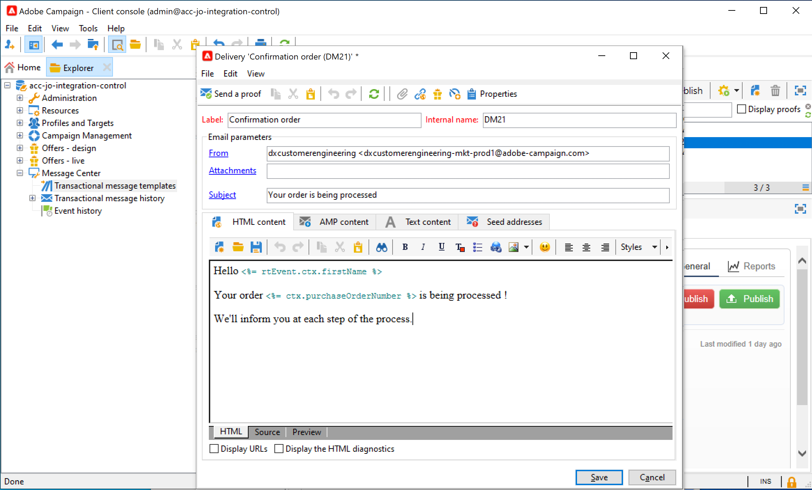
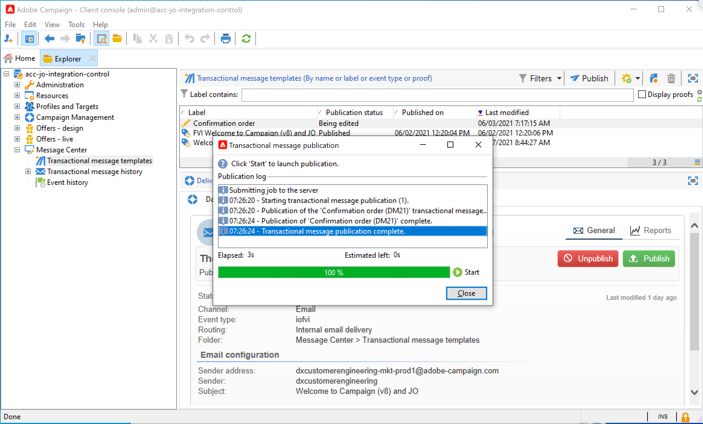
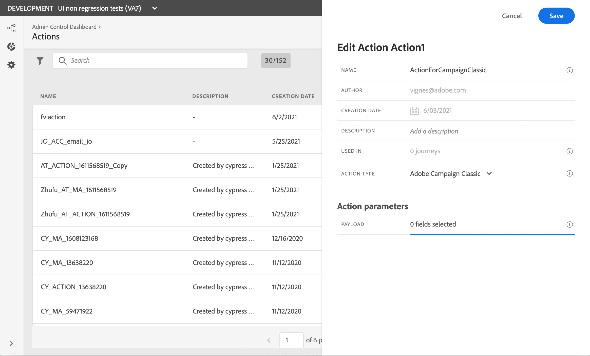
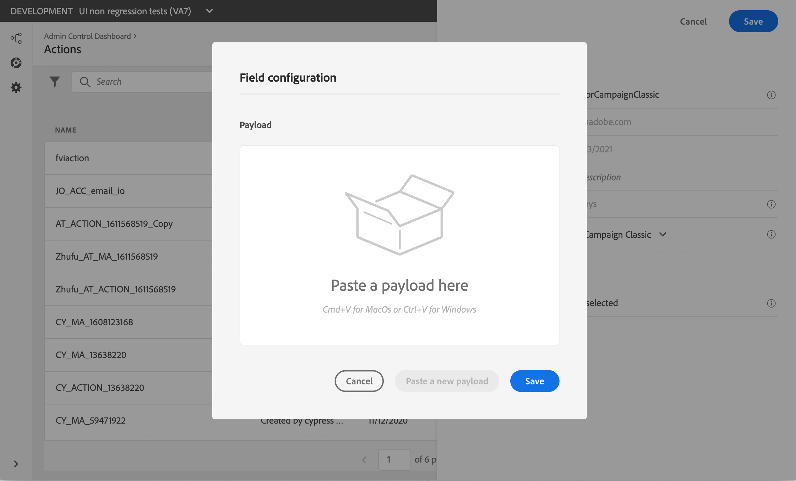
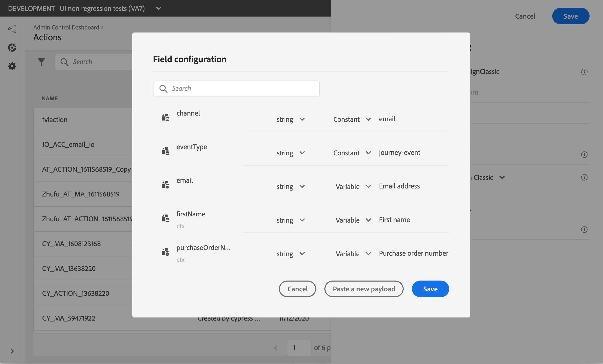
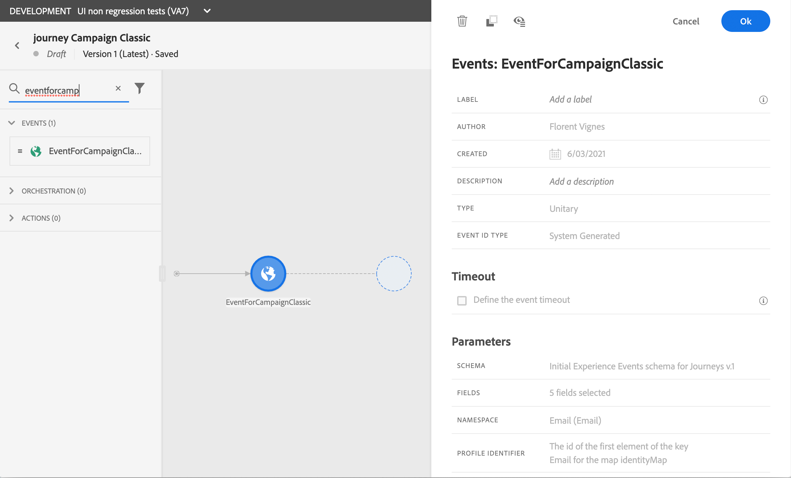
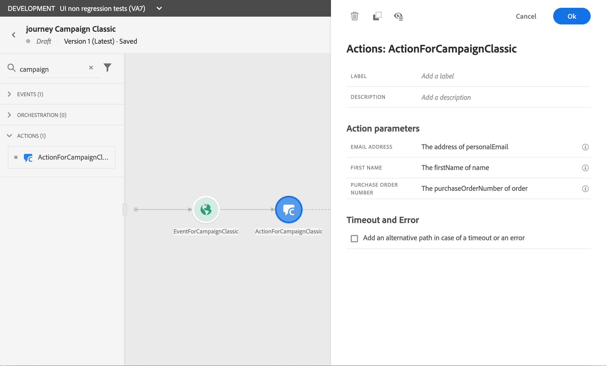

# Using Adobe Campaign Classic {#using_campaign_classic}

An integration is available if you have Adobe Campaign Classic. It will allow you to send emails, push notifications and SMS using Adobe Campaign Classic Transactional Messaging capabilities.

The connection between the Journey Orchestration and Campaign Classic instances is setup by Adobe at provisioning time. Contact Adobe.

For this to work, you need to configure a dedicated action. Refer to this [section](../action/acc-action.md).

1. Design your journey, starting with an event. See this [section](../building-journeys/journey.md).
1. In the **Action** section of the palette, select a Campaign Classic action and add it to your journey.
1. In the **Action parameters**, all the fields expected in the message payload are displayed. You need to map each of these fields with the field you want to use, either from the event or from the data source. This is similar to custom actions. Refer to this [section](../building-journeys/using-custom-actions.md).


## Use case

This use case presents all the steps needed to send an email using the Adobe Campaign Classic integration. 
We will first create a transactional email template in Campaign Classic. Then, in Journey Orchestration, we'll create the action and design the journey.

**Adobe Campaign Classic**

Your Campaign Classic instance needs to be provisioned for this integration. The Transactional Messaging feature needs to be configured.

1. Log in to your Campaign Classic control instance. 

1. Under **Administration** > **Platform** > **Enumerations**, select the **Event type** (eventType) enumeration. Create a new event type ("journey-event", in our example). You will have to use the internal name of the event type when writing the JSON file. 

    

1. Disconnect and reconnect to the instance for the creation to be effective.

1. Under **Message Center** > **Transactional message templates**, create a new email template based on the event type previously created.

    

1. Design your template. In this example, we use personalization on the profile's first name and the order number. The first name is in the Adobe Experience Platform data source, and the order number is a field from our Journey Orchestration event. Make sure you use the correct field names in Campaign Classic. 

    

1. Publish your transactional template.

    

1. Now you need to write the JSON payload corresponding the template. 

```
{
     "channel": "email",
     "eventType": "journey-event",
     "email": "Email address",
     "ctx": {
          "firstName": "First name", "purchaseOrderNumber": "Purchase order number"
     }
}
```

    * For the channel, you need to type "email".
    * For the eventType, use the internal name of the event type created previously.
    * The email address will be a variable, so you can type any label.
    * Under ctx, the personalization fields are also variables.

**Journey Orchestration**

1. First, you need to create an event. Make sure you include the "purchaseOrderNumber".

    

1. You then need to create, in Journey Orchestration, an action corresponding to your Campaign Classic template. In the **Action type** drop-down, select **Adobe Campaign Classic**. 

    

1. Click the **Payload field** and paste the JSON created previously.

    

1. For the email address and two personalization fields, change **Constant** to **Variable**.

    

1. Now create a new journey and start with the event created before.

    

1. Add the action and map each field to the correct field in Journey Orchestration. 

    

1. Add an **End** activity and test your journey.

    

1. You can now publish your journey.
