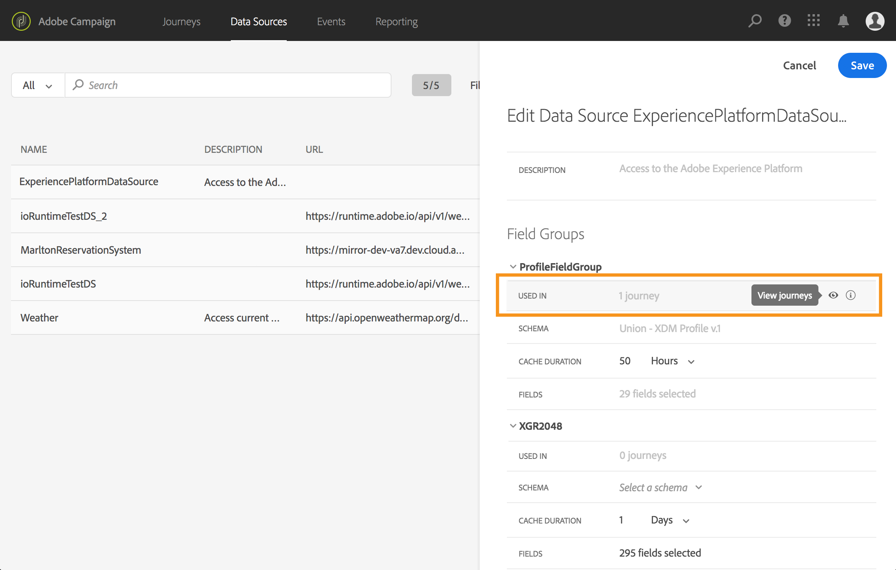

# Field groups {#concept_ntl_ypt_52b}

>[!CAUTION]
>
>**Looking for Adobe Journey Optimizer**? Click [here](https://experienceleague.adobe.com/en/docs/journey-optimizer/using/ajo-home){target="_blank"} for Journey Optimizer documentation.
>
>
>_This documentation refers to legacy Journey Orchestration materials which has been replaced by Journey Optimizer. Please contact your account team if you have questions about your access to Journey Orchestration or Journey Optimizer._

Field groups are sets of fields that you can retrieve from a data source and use in a journey.

## Defining field groups {#section_dsz_kjd_fjb}

For each data source, you can define several field groups.

For example, you can create a field group with the telephone number, the email, the first name and the address of the profile. You will then be able to use this data in your journey to create conditions. For example, you can decide to send an SMS only if the profile's telephone number is not empty. If it is empty, you can send an email.

Even though a default name is automatically added, we recommend that you give a name to  your field group. Indeed, the field group name will be visible to other users in [!DNL Journey Orchestration]. Giving a relevant name to field groups is a best practice.

When a data source field is used in a journey, the system will retrieve all the fields defined for that field group. Therefore, selecting only the fields that you need for your journeys is a best practice. This will reduce the request latency in your journeys thus increasing performance. Note that you can easily add more fields in field groups later.

The number of journeys that use a field group is displayed in the **[!UICONTROL Used in]** field. You can click the **[!UICONTROL View journeys]** button to display the list of journeys using this field group.

>[!NOTE]
>
>Note that if a field group has no field, it won't be displayed in the expression editor.

 

## Field group lifecycle {#section_abk_njd_fjb}

You can add or remove fields from a field group that is not used in any draft or live journey.

You can add but you cannot remove a field from a field group used in one or more draft or live journeys. This will avoid breaking journeys.

To delete a field from a field group used in one or more journeys, follow these steps. Let's use an example of a field group named "Field Group A".

1. In the list of field groups, place the cursor on "Field Group A" and click on the **[!UICONTROL Duplicate]** icon located on the right. Name the duplicated field group "Field Group B", for example.
1. In "Field Group B", remove the fields you no longer want.
1. In "Field Group A", check where this field group is used. This information is displayed in the **[!UICONTROL Used in]** field.
1. Open all the journeys which use "Field Group A".
1. Create new versions of each of these journeys. Edit all activities using "Field Group A" and select "Field Group B".
1. Stop old versions of journeys that use "Field Group A". You should then have no journey using "Field Group A".
1. Remove "Field Group A" as is it not used anymore.
