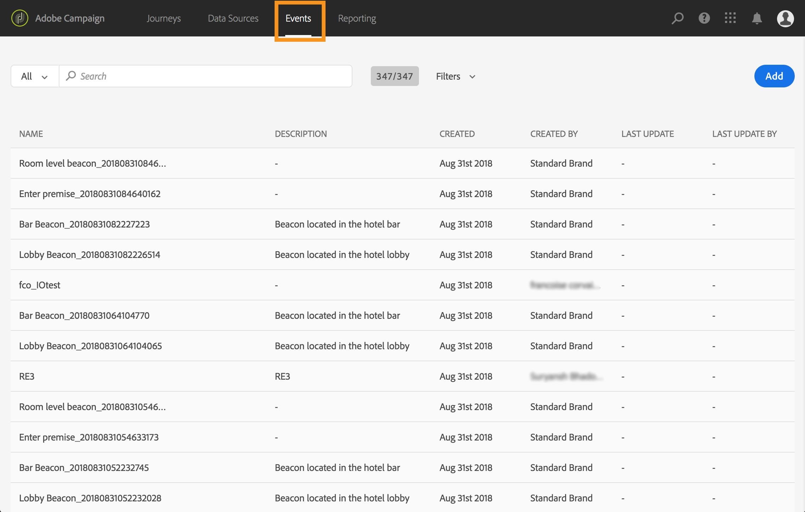
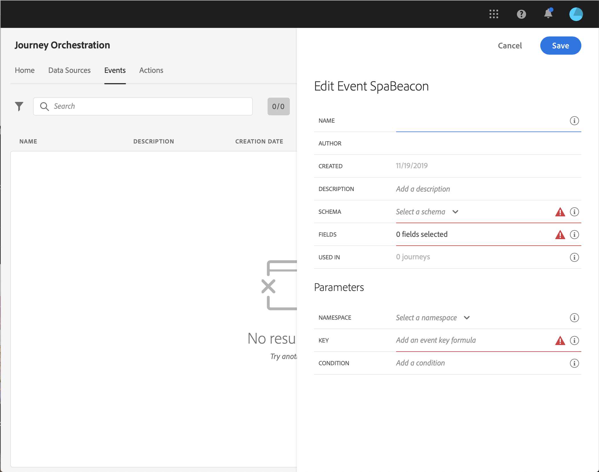

# Creating a new event {#section_tbk_5qt_pgb}

Here are the main steps to configure a new event:

1. In the top menu, click on the **[!UICONTROL Events]** tab. The list of events is displayed. Refer to [this page](../about/user-interface.md) for more information on the interface.

    

1. Click **[!UICONTROL Add]** to create a new event. The event configuration pane opens on the right side of the screen.

    

1. Enter a name for your event. 

    >[!NOTE]
    >
    >Do not use spaces or special characters. Do not use more than 30 characters.

1. Add a description to your event. This step is optional.
1. Define the schema and payload fields: this is where you select the event information (usually called a payload) [!DNL Journey Orchestration] expects to receive. You will then be able to use this information in your journey. See [this page](../event/defining-the-payload-fields.md).
1. The number of journeys that use this event is displayed in the **[!UICONTROL Used in]** field. You can click the **[!UICONTROL View journeys]** icon to display the list of journeys using this event.
1. Add a namespace. This step is optional but recommended as adding a namespace allows you to leverage information stored in the Real-time Customer Profile Service. It defines the type of key the event has. See [this page](../event/selecting-the-namespace.md).
1. Define the key: choose a field from your payload fields or define a formula to identify the person associated to the event. This key is automatically setup (but can still be edited) if you select a namespace. Indeed, [!DNL Journey Orchestration] picks the key that should correspond to the namespace (for example, if you select an email namespace, the email key will be selected). See [this page](../event/defining-the-event-key.md). 
1. Add a condition. This step is optional. This allows the system to only process the events that meet the condition. The condition can only be based on information contained in the event. See [this page](../event/adding-a-condition.md).
1. Click **[!UICONTROL Save]**.

    

    The event is now configured and ready to be dropped into a journey. Additional configuration steps are required to receive events. See [this page](../event/additional-steps-to-send-events-to-journey-orchestration.md).
