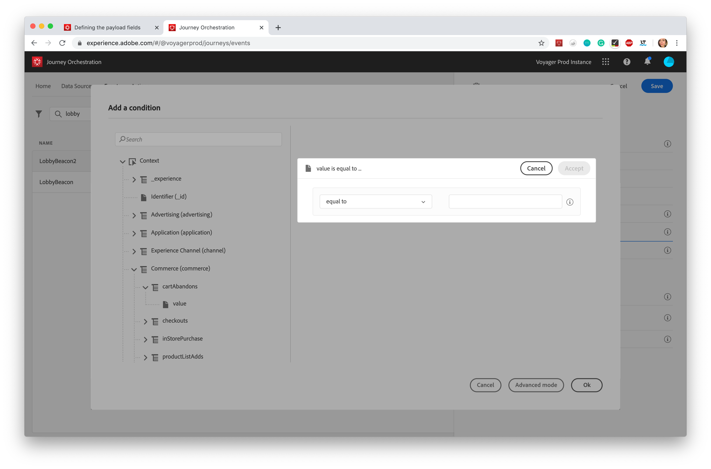

# Adding a condition {#concept_rbg_gqt_52b}

For system-generated events, you can define an event condition which allows the system to filter the processing of events. If the condition is true, the event is processed. If the condition is not true, the event is ignored.

The condition on events can only be based on data passed in the event payload. The condition defined at event level cannot be changed in the canvas by a marketer. The purpose is to harden this condition when this event is used. For example, if you never want marketers to use cart abandonment events if the cart value is too small, you can create a condition on the “cart value” event field and impose a value above 100 dollars.

You can use the simple expression editor or the advanced expression editor to setup conditions on events. See [this page](../expression/expressionadvanced.md).

For example, you can define a condition to only process the events of a specific event type and ignore the other types. Or if your event is a cart abandonment and the payload includes the cart value field, you can define an event condition to process the events only if the cart value is greater than 100 dollars.

