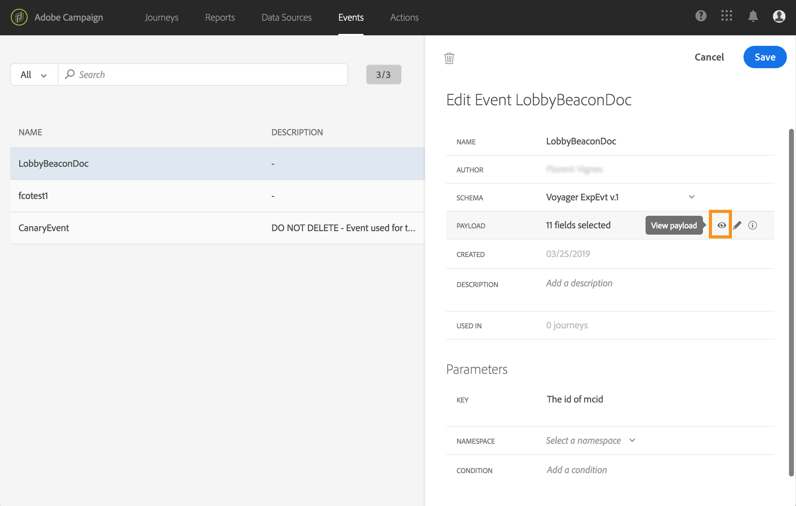
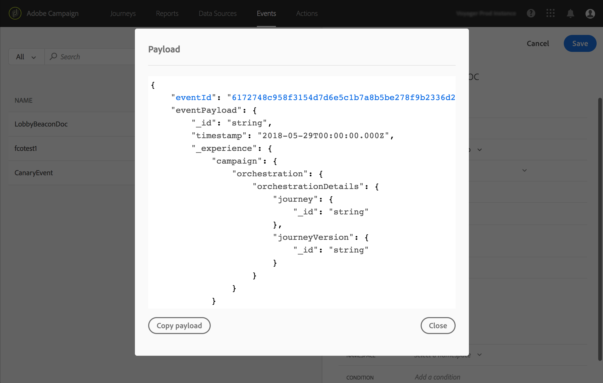

# Previewing the payload {#concept_jgf_4yk_4fb}

>[!CAUTION]
>
>**Looking for Adobe Journey Optimizer**? Click [here](https://experienceleague.adobe.com/en/docs/journey-optimizer/using/ajo-home){target="_blank"} for Journey Optimizer documentation.
>
>
>_This documentation refers to legacy Journey Orchestration materials which has been replaced by Journey Optimizer. Please contact your account team if you have questions about your access to Journey Orchestration or Journey Optimizer._

The payload preview allows you to validate the payload definition.

>[!NOTE]
>
>For system-generated events, when you create an event, before viewing the payload preview, save your event and re-open it. This step is needed to generate an event ID in the payload.

1. Click the **[!UICONTROL View Payload]** icon to preview the payload expected by the system.

    

    You can notice that the fields selected are displayed.

    

1. Check the preview to validate the payload definition.

1. Then, you can share the payload preview with to the person responsible for the event sending. This payload can help them design the setup of an event pushing to [!DNL Journey Orchestration]. See [this page](../event/additional-steps-to-send-events-to-journey-orchestration.md).
