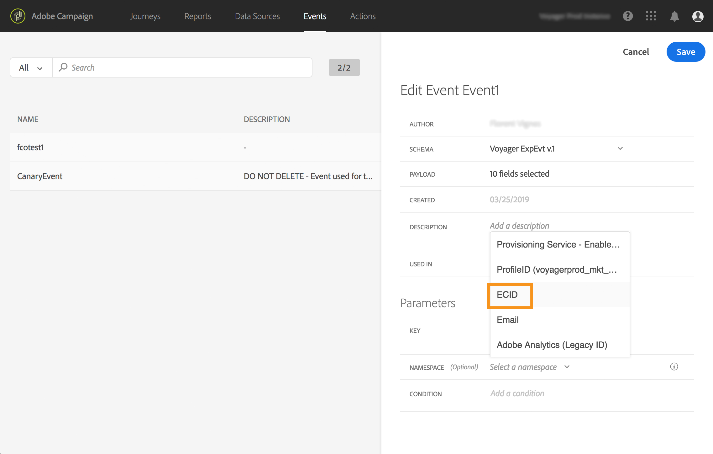

# Selecting the namespace {#concept_ckb_3qt_52b}

The namespace allows you to define the type of key used to identify the person associated to the event. Its configuration is optional. It is required if you want to retrieve, in your journeys, additional information coming from the [Real-time Customer Profile](https://docs.adobe.com/content/help/en/experience-platform/profile/home.html). The namespace definition is not needed if you're only using data coming from a third-party system through a custom data source.

You can either use one of the predefined ones or create a new one using the Identity Namespace service. Refer to this [page](https://docs.adobe.com/content/help/en/experience-platform/identity/home.html).

If you select a schema that has a primary identity, then the **[!UICONTROL Key]** and **[!UICONTROL Namespace]** fields are pre-filled. If there is no identity defined, we select _identityMap > id_ as the primary key. Then you have to select a namespace and the key will be pre-filled (below the **[!UICONTROL Namespace]** field) using _identityMap > id_.

When selecting fields, primary identity fields are tagged. 

Select a namespace from the drop-down list.

Only one namespace is allowed per journey. If you use several events in the same journey, they need to use the same namespace. See [this page](../building-journeys/journey.md).
