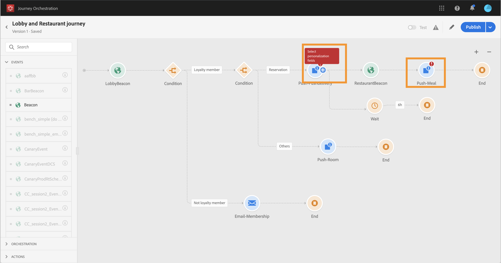
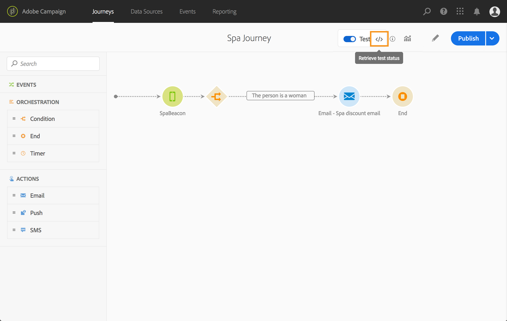

# Testing and publishing the journey{#concept_mtc_lrt_52b}

## Checking for errors {#section_h3q_kqk_fhb}>

Before testing and publishing your journey, verify that all the activities are properly configured.
Errors appear with a warning symbol displayed on the activities themselves in the canvas. Place your cursor on the exclamation mark to display the error message. For example, if a mandatory field is empty, an error will be displayed. 

    

## Testing your journey {#section_ctr_lqk_fhb}

You have the possibility to test your journey before its publication, using test profiles. This allows you to analyze how individuals flow in the journey and troubleshoot before publication.

**Important notes:**

* Events need to be sent to Journeys.
* Only individuals flagged as "test profiles" in the Unified Profile Service will be allowed to enter the tested journey.
* The test mode is only available in draft journeys that use namespaces.
* The maximum number of test profiles than can enter a journey is 100.
* When you disable the test mode, it empties the journeys from all people who entered it in the past or who are currently in it.
* You can enable/disable the test mode as many times as needed.
* You cannot modify your journey when the test mode is activated. When in test mode, you can directly publish the journey, no need to deactivate the test mode before.

To use the test mode, follow these steps:

1. Before testing your journey, verify that it is valid and that there is no error. See [Checking for errors](#section_h3q_kqk_fhb). A warning symbol is displayed when there are errors.
1. To activate the test mode, click on the **Test** toggle, located in the top right corner.
    
    

1. After the events are received, click the **&lt;/>** button to view the test result.

    

1. Verify the test result. This page displays the journey’s current information in JSON format. A button allows you to copy entire nodes. You need to refresh the page to update the journey’s test results. 

The number of individuals (__instances__) currently inside the journey are displayed. Here are examples of useful information that is displayed for each individual:
* __Id__: the individual’s internal ID in the journey. This can be used for debugging purposes.
* __currentstep__: the step where the individual is at in the journey. We recommend adding labels to your activities to identify them more easily.
* __currentstep__ > phase: the status of the individual’s journey (running, finished, error or timed out). See below for more information.
* __currentstep__ > __extraInfo__: description of the error and other contextual information.
* __externalKeys__: the value for the key formula defined in the event.
* __enrichedData__: the profile data that the journey has retrieved if the journey uses data sources with field groups.
* __transitionHistory__: the list of steps that the individual followed. For events, the payload is displayed.

1. If there is any error, deactivate the test mode, modify your journey and test it again. When the test is conclusive, you can publish your journey. See [Publishing your journey](#section_w1b_mqk_fhb).

Here are the different statuses of an individual's journey:

* __Running__: the individual is currently in the journey.
* __Finished__: the individual is at the end of the journey.
* __Error__: the individual is stopped in the journey because of an error.
* __Timed out__: the individual is stopped in the journey because of a step which took too much time.

# Publishing your journey {#section_w1b_mqk_fhb}

1. Before publishing your journey, verify that it is valid and that there is no error. See [Checking for errors](#section_h3q_kqk_fhb). A warning symbol is displayed when there are errors. It is also recommended to test your journey before publication. See [Testing your journey](#section_ctr_lqk_fhb).
1. To publish the journey, click on the **Publish** option, located in the top right drop-down menu.

When the journey is published, it is in read-only mode. 
If you need to make modifications to a published journey, you need to create a new version of your journey. See [Journey versions](journeyversions.md#concept_ldc_k55_zgb).
If you stop a journey, it will be permanently stopped. If you need to use it again, you need to duplicate it and publish it.
