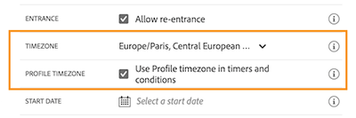

# Release Notes {#release-notes}

This page lists all the new features and improvements for Journey Orchestration.
You can also consult the latest [Documentation Updates](../release-notes/documentation-updates.md).

## October 2021 Release {#october-2021-release}

### Improvements

* **Expression editor** - As a power user, you can now use functions to work with maps. [Learn more in this sample](../expression/field-references.md) 
* **Accessibility** - Accessibility enhancements have been implemented. Journey Orchestration is now fully compliant in terms of accessibility.
* **Collections** - Arrays of objects containing sub-objects are now supported. [Read more](../usecase/collections.md)
* **Monitoring** - Step events for live journeys and test mode have been enhanced. [New fields](../building-journeys/sharing-field-list.md#serviceevents) have been added related to profile export jobs. For a better user experience, step event fields are now organized in different categories in the Journey Step Event schema for Journey Orchestration. All previous step events fields are still available in the [stepEvents](../building-journeys/sharing-legacy-fields.md) category. 

## September 2021 Release {#september-2021-release}

<table>
<thead>
<tr>
<th><strong>Pass lists of data dynamically using custom actions</strong> </th>
</tr>
</thead>
<tbody>
<tr>
<td>

You can now pass collections or a list of data in your custom action parameters that will be dynamically populated at runtime. Two kinds of collections are supported: simple collections and object collections. Previously created custom actions will continue working. 

For more information on collections, refer to the <a href="../usecase/collections.md">detailed documentation</a>. 

The filter and intersect functions have been added to the list of functions available in the advanced expression editor. This offers more possibilities for collection filtering and comparing.

Consult the documentation on the <a href="../functions/functionfilter.md">filter</a> and <a href="../functions/functionintersect.md">intersect</a> functions.

</td>
</tr>
</tbody>
</table>

### Improvements

* System generated schemas and datasets that have been created during provisioning for step events are now in read-only mode, safeguarding against any inadvertent modifications to critical schemas. [Learn more](../building-journeys/sharing-overview.md) 
* Cleanly label the **Wait** activity with a label that will be displayed in the canvas. The label is also used in reporting and test mode logs to clearly identify what you are doing. [Learn more](../building-journeys/using-the-journey-designer.md) 
* Find your events and actions faster by filtering elements in the **Events** and **Action** categories using search. Orchestration activities are no longer filtered. [Learn more](../building-journeys/using-the-journey-designer.md)
* When defining an event ID condition in a rule-based, the "contains" operator is now available for string types of fields. [Learn more](../event/about-creating.md)

## August 2021 Release {#august-2021-release}

### Improvements

**Journeys**

* **Dynamic headers** - You can now pass dynamic data in HTTP header parameters. These parameters can be used by the integration systems that receive the journey action HTTP calls, for example timestamp or tracking ID. [Read more](../action/url-configuration.md)
* **Dynamic URL paths** - You can now set up dynamic URL paths for custom actions. [Read more](../action/url-configuration.md)

## July 2021 Release {#july-2021-release}

<table>
<thead>
<tr>
<th><strong>Leverage schema relationships</strong> </th>
</tr>
</thead>
<tbody>
<tr>
<td>

Adobe Experience Platform allows you to define relationships between schemas in order to use one dataset as a lookup table for another. Journey Orchestration can now leverage data coming from a linked schema.

These fields are available in unitary event configuration, journey conditions and custom action personalization.

For more information, refer to the <a href="../event/experience-event-schema.md#leverage_schema_relationships">detailed documentation</a>.

</td>
</tr>
</tbody>
</table>

### Improvements

* The **Cache duration** field has been removed from the data source configuration pane. [Read more](../datasource/about-data-sources.md)

## June 2021 Release {#june-2021-release}

<table>
<thead>
<tr>
<th><strong> Adobe Campaign Classic integration</strong> </th>
</tr>
</thead>
<tbody>
<tr>
<td>

The integration with Adobe Campaign Classic integration is now GA. It allows you to send emails, push notifications and SMS using Adobe Campaign v7 or v8 Transactional Messaging capabilities.

The connection between the Journey Orchestration and Campaign instances is setup by Adobe at provisioning time.

For more information, refer to the <a href="../action/acc-action.md">detailed documentation</a>.

</td>
</tr>
</tbody>
</table>

### Improvements

* For external data sources, a capping rule of 15 calls per second is now automatically defined. [Read more](../about/external-systems.md#capping)
* The simple and advanced expression editors now support the XDM date format. 
* In the journey list screen, a new filter has been added. You can now filter by journey type: **[!UICONTROL Unitary event]** or **[!UICONTROL Segment qualification]**. [Read more](../about/user-interface.md#section_lgm_hpz_pgb)
* For live journeys, the journey properties screen now displays the publication date and the name of the user who published the journey. This information is also available when you copy the journey's technical details. [Read more](../building-journeys/changing-properties.md#section_lgm_hpz_pgb)

## April 2021 Release {#april-2021-release}

### Improvements

* In the **Event configuration** screen of the test mode, a dropdown is now displayed for fields that expect an enumeration. Simply select one of the available values. This will avoid errors when triggering the event if an incorrect value is defined. [Read more](../building-journeys/testing-the-journey.md#firing_events)

## March 2021 Release {#march-2021-release}

### Improvements

* A new status has been added to journeys. When a journey ends or is manually closed, its status switches from **Closed** to **Finished** 30 days after it was closed. This will allow you to identify inactive journeys more easily while making sure all individuals still present have time to finish the journey. [Read more](../building-journeys/journey.md#ending_a_journey)
* In the activity right panes of draft journeys, read-only fields are now hidden by default. This interface simplification will help you configure your activities more easily. To display them, click the **Show read-only fields** icon, available in the top left corner of the activity configuration pane. [Read more](../building-journeys/using-the-journey-designer.md#configuration_pane)
* In test mode, in the **Event configuration** screen, the **Key** field used to define the test profile's ID has been renamed **Profile identifier** for a better user experience. [Read more](../building-journeys/testing-the-journey.md).
* For reaction events, the timeout duration can now only be set between 40 seconds and 30 days. When testing a journey that uses a reaction event, the test mode **[!UICONTROL Wait time]** default and minimum value is now 40 seconds. [Read more](../building-journeys/reaction-events.md).

## February 2021 Release {#february-2021-release}

<table>
<thead>
<tr>
<th><strong>Update profile activity</strong> </th>
</tr>
</thead>
<tbody>
<tr>
<td>

This new action activity allows you to update an existing Adobe Experience Platform profile with information coming from the event, a datasource or using a specific value.

For more information, refer to the <a href="../building-journeys/update-profiles.md">detailed documentation</a>.

</td>
</tr>
</tbody>
</table>

### Other improvements

* Now, when configuring an event, only fields that are mandatory for the XDM validation are pre-selected by default. These fields cannot be unselected.
* In the journey palette, a new filter has been added. It allows you to only display the last five events and actions used, in addition to out-of-the-box ones. This is specific to each user. By default, all items are displayed. [Read more](../building-journeys/using-the-journey-designer.md#palette)
* When starting a new journey, elements that cannot be dropped in the canvas as the first step are now hidden. This concerns all actions, the condition activity, the wait and the reaction.
* In the left part of the advanced expression editor, functions are now regrouped under a **Functions** section at the end of the list. 

## January 2021 Release {#january-2021-release}

When selecting a schema in the event configuration, only fields that are mandatory for the event to be received properly by Journey Orchestration are selected. [Read more](../event/defining-the-payload-fields.md)

Journey properties attributes are now available in the simple expression editor. [Read more](../expression/journey-properties.md)

Two new journey properties attributes have been added (sandboxName and organizationId). [Read more](../expression/journey-properties.md)

To align with Adobe Campaign Standard SLAs, a capping rule of 13 calls per second is now automatically defined for Adobe Campaign Standard actions as soon as Adobe Campaign Standard integration is set up. [Read more](../action/working-with-adobe-campaign.md)

The event timeout duration is now specified more clearly on the timeout path. [Read more](../building-journeys/event-activities.md#listening-to-events-during-a-specific-time)

The [getListItem](../functions/functiongetlistitem.md) and [split](../functions/functionsplit.md) functions have been added to the list of functions available in the advanced expression editor. This will offer more possibilities in your string computation use cases.

## November 2020 Release {#november-release}

<table>
<thead>
<tr>
<th><strong>Jumping from one journey to another</strong> </th>
</tr>
</thead>
<tbody>
<tr>
<td>

A new action activity allows you to push individuals from one journey to another. The <strong>Jump</strong> activity allows you to:

<ul>
<li>simplify the design of very complex journeys by splitting them into several ones </li>
<li>build journeys based on common and reusable journey patterns</li>
</ul>

For more information, refer to the <a href="../building-journeys/jump.md">detailed documentation</a> and <a href="https://experienceleague.adobe.com/docs/journey-orchestration-learn/tutorials/building-a-journey/jumping-to-another-journey.html">tutorial video</a>.

</td>
</tr>
</tbody>
</table>

<table>
<thead>
<tr>
<th><strong>Using journey properties in the expression editor</strong> </th>
</tr>
</thead>
<tbody>
<tr>
<td>

In the advanced expression editor, we've added a new category in the list of fields and functions. This is the information retrieved by the system from live journeys, such as the journey ID or the specific errors encountered. This will give you more possibilities when building your journeys. For example, you will be able to alert third-party systems in case of errors encountered in a condition or an action.

For more information, refer to the <a href="../expression/journey-properties.md">detailed documentation</a>.

</td>
</tr>
</tbody>
</table>

<table>
<thead>
<tr>
<th><strong>Rule-based events (beta)</strong> </th>
</tr>
</thead>
<tbody>
<tr>
<td>

A new method is now available to set up your events more easily, without using an eventID: rule-based events evaluate if the event should be triggered according to a condition. You can still use the existing method, now called "system-generated". This feature, which has been tested among a limited set of customers through the Alpha program, is now available in Beta to all customers.

</td>
</tr>
</tbody>
</table>

### Other improvements

Limitations have been added when creating new versions of a journey. These limitations avoid too drastic changes in the journey to keep some consistency between versions. [Read more](../about/limitations.md#journey-versions-limitations)

The **Segment Qualification** activity can no longer be used in a journey that includes Campaign Standard message activities. This restriction protects the integrity of Adobe Campaign Standard instances. Indeed, Segment Qualification usage can lead to daily peaks of message sending that would overload Campaign Standard Transactional Messaging. [Read more](../about/limitations.md#segment-qualification)

## October 2020 Release {#october-release}

<table>
<thead>
<tr>
<th><strong>Event timeout</strong> </th>
</tr>
</thead>
<tbody>
<tr>
<td>

You can now configure a timeout for an event in order to make a journey listen to an event only during a certain time. You no longer need to add a Wait activity in parallel to the event path to achieve this.

For more information, refer to the <a href="../building-journeys/event-activities.md#listening-to-events-during-a-specific-time">detailed documentation</a>.

</td>
</tr>
</tbody>
</table>

### Other improvements

* When you publish a new version of a journey, the previous version automatically ends and switches to the Closed status. [Read more](../building-journeys/journey-versions.md)

## September 2020 Release {#september-release}

### GA updates{#september-ga-update}

<table>
<thead>
<tr>
<th><strong>Condition activity improvements</strong> </th>
</tr>
</thead>
<tbody>
<tr>
<td>

When adding conditions to your journey, you can now define a label. If you use several conditions in a journey, this allows you to identify them more easily.

For more information, refer to the <a href="../building-journeys/condition-activity.md#about_condition">detailed documentation</a>.

</td>
</tr>
</tbody>
</table>

### Alpha updates{#september-alpha-update}

<table>
<thead>
<tr>
<th><strong>Read segment activity improvements</strong> </th>
</tr>
</thead>
<tbody>
<tr>
<td>

The following improvements have been made to the <strong>Read segment</strong> activity:

<ul>
<li>
Segment-based journeys now display, above the canvas, a reminder of the journey's schedule type. You can click on this reminder to access the schedule configuration menu.

</li>
<li>
The granularity of test mode logs has been improved to display the segment export progress status.

</li>
</ul>
</td>
</tr>
</tbody>
</table>

## August 2020 Release {#august-release}

### GA updates{#august-ga-update}

The payload of Segment Qualification events now contains the following context information, which you can use in conditions and actions: the behavior (entrance, exit), the timestamp of qualification and the segment id. [Read more](../building-journeys/segment-qualification-events.md)

### Alpha updates{#august-alpha-update}

<table>
<thead>
<tr>
<th><strong>Segment Trigger activity</strong> </th>
</tr>
</thead>
<tbody>
<tr>
<td>

The following improvements have been made to the Segment Trigger activity:

<ul>
<li>
The activity's name has been changed to "Read Segment". 

</li>
<li>
The configuration of the journey scheduler has been removed from the activity’s properties. It is now accessible directly from the Journey's properties, in a dedicated section that will display if a Read Segment activity has been dropped into the canvas. 

</li>
<li>
You can now test the journey on a unitary profile and track its progress in the journey using the visual flow.

</li>
</ul>
</td>
</tr>
</tbody>
</table>

<table>
<thead>
<tr>
<th><strong>Rule-based events</strong> </th>
</tr>
</thead>
<tbody>
<tr>
<td>

The following improvements have been made to rule-based events:

<ul>
<li>
You can now leverage all of the Adobe Analytics behavioral event data that you are already capturing and streaming into the Platform in order to trigger journeys and automate experiences for your customers. <a href="../event/about-analytics.md">Read more</a>

</li>
<li>
When triggering a rule-based event in test mode, you can now directly view the event ID condition. Also, a tooltip has been added next to each field that is part of the rule evaluation. <a href="../building-journeys/testing-the-journey.md#test-rule-based">Read more</a>

</li>
<li>
The rule-based event definition screen has been reorganized for an improved experience. <a href="../event/about-creating.md">Read more</a>

</li>
</ul>
</td>
</tr>
</tbody>
</table>

## Alpha Release - July 2020 {#alpha-release---july-2020}

The Alpha program offers features that are currently tested among a limited set of customers. This allows us to improve our product based on the feedback received. These features are not available to all Journey Orchestration customers.

<table>
<thead>
<tr>
<th><strong>Enhanced user interface</strong> </th>
</tr>
</thead>
<tbody>
<tr>
<td>

Navigation within Journey Orchestration menus has been enhanced, in order to provide a consistent interface with Adobe Experience Platform:

<ul>
<li>
Menus moved from the top to the left-hand side of the interface. 

</li>
<li>
Grouping of admin functionalities into a single dashboard.

</li>
</ul>
</td>
</tr>
</tbody>
</table>

<table>
<thead>
<tr>
<th><strong>Segment Trigger activity</strong> </th>
</tr>
</thead>
<tbody>
<tr>
<td>

The Segment Trigger activity allows you to make all individuals belonging to an Adobe Experience Platform segment enter a journey. Entrance into a journey can be executed either once, or on a regular basis. 

</td>
</tr>
</tbody>
</table>

<table>
<thead>
<tr>
<th><strong>Rule-based events</strong> </th>
</tr>
</thead>
<tbody>
<tr>
<td>

We have simplified the way you set up Experience events. We're introducing a new method that does not require the use of an eventID. When you set up your event in Journey Orchestration, you can now define a rule-based event. <a href="../event/about-events.md">Read more</a>

</td>
</tr>
</tbody>
</table>

## Q2 Release - June 2020 {#q2-release---june-2020}

<table>
<thead>
<tr>
<th><strong>Adobe Experience Platform integration enhancements</strong> </th>
</tr>
</thead>
<tbody>
<tr>
<td>

The following Adobe Experience Platform integration enhancements have been made:

<ul>
<li>
A new activity allows the listening of Adobe Experience Platform segment entrances/exits to make people enter or move forward in a journey. <a href="../building-journeys/segment-qualification-events.md">Read more</a>

</li>
<li>
Adobe Experience Platform segments can now be created and edited without leaving the Journey Orchestration interface, thanks to a new <strong>Segments</strong> tab. <a href="../segment/about-segments.md">Read more</a>

</li>
<li>
In the simple expression editor, Adobe Experience Platform segments are now directly listed in the navigation tree to allow easy setup of conditions such as "does this person belong to segment A?". <a href="../segment/using-a-segment.md">Read more</a>

</li>
<li>
Journey Orchestration is now automatically passing, to the Adobe Experience Platform, the steps executed in journeys. This includes potential errors encountered. This information can be used for achieving reporting and troubleshooting by executing queries on the Journey Step events for a particular journey or for all journeys. <a href="../building-journeys/sharing-overview.md">Read more</a>

</li>
<li>
Journey Orchestration can now be connected to production and non-production Adobe Experience Platform sandboxes. Note that sandboxes is a beta feature. <a href="../about/access-management.md#sandboxes">Read more</a>

</li>
</ul>
</td>
</tr>
</tbody>
</table>

<table>
<thead>
<tr>
<th><strong>Journey designer and test mode enhancements</strong> </th>
</tr>
</thead>
<tbody>
<tr>
<td>

The following enhancements have been made to the journey designer and the test mode:

<ul>
<li>
You can now copy paste activities from one journey to another, selecting 1 or N journey activities. <a href="../building-journeys/using-the-journey-designer.md#copy-paste">Read more</a>

</li>
<li>
After firing an event to make a test profile enter a journey, you can now see its progress along the journey thanks to a colored visual flow. In case of error in the journey, details of errors are also displayed. <a href="../building-journeys/testing-the-journey.md#firing_events">Read more</a>

</li>
<li>The <strong>Finished</strong> journey state has been renamed <strong>Closed (no entrance)</strong> to better reflect what this state means.</li>
</ul>
</td>
</tr>
</tbody>
</table>

**Other improvements**

To avoid sending too many API calls to third-party systems, we're introducing a new public API to setup "capping" rules. Capping rules allow the definition of a maximum number of calls to an API endpoint per milliseconds. [Read more](../api/capping.md)

Access control now allows more granularity in user access management. Effective availability: June, 30 2020. [Read more](../about/access-management.md#create-product-profile)

Journey Orchestration is now available in APAC (Australian data center). Effective availability: June, 30 2020

The Journey Orchestration interface is available in Japanese.

## Q1 Release - March 2020 {#q1-release---march-2020}

<table>
<thead>
<tr>
<th><strong>Test mode enhancements</strong> </th>
</tr>
</thead>
<tbody>
<tr>
<td>

The following enhancements have been made to the test mode:

<ul>
<li>When a journey uses several events, you can now trigger each of them individually from a drop-down list, in the <strong>Event configuration</strong> screen of the test mode. <a href="../building-journeys/testing-the-journey.md#firing_events">Read more</a>
</li>
<li>
When one or more <strong>Wait</strong> activities are used in a journey, you can now define the time that each of these activities will last in test mode. The default time is 10 seconds. You can change this using the <strong>Wait time in test</strong> parameter, in the bottom left corner. <a href="../building-journeys/testing-the-journey.md">Read more</a>

</li>
<li>In the <strong>test logs</strong>, in case of an error when calling a third-party system (data source or action), the error code and error response are now displayed. <a href="../building-journeys/testing-the-journey.md#viewing_logs">Read more</a>
</li>
</ul>
</td>
</tr>
</tbody>
</table>

<table>
<thead>
<tr>
<th><strong>Centralized timezone management</strong> </th>
</tr>
</thead>
<tbody>
<tr> 
<td>

Timezone management is now centralized in the journey properties panel. Two parameters have been added in the journey properties:

<ul>
<li>The <strong>Timezone</strong> drop-down list allows you to select a specific timezone. By default, the browser's timezone is used. </li>
<li>The <strong>Profile Timezone</strong> checkbox allows you to use the Adobe Experience Platform Profile timezone of the person entering the journey, if available. If not, the timezone defined in the drop-down list is used. This feature is not compatible with journeys using events that do not have a namespace.</li>
</ul>

For more information, refer to the <a href="../building-journeys/changing-properties.md#timezone">Changing properties</a> and <a href="../building-journeys/timezone-management.md">Timezone management</a> sections.

</td>
</tr>
</tbody>
</table>

<table>
<thead>
<tr>
<th><strong>Journey designer enhancements</strong> </th>
</tr>
</thead>
<tbody>
<tr> 
<td>

The journey <strong>palette</strong>, on the left side of the journey designer has been enhanced:

<ul>
<li>A new icon, next to the <strong>Search</strong>  bar, allows you to hide or display unavailable elements in the palette, for example the events that use a different namespace than the ones used in your journey. By default, unavailable items are hidden.</li>
<li>When using the <strong>Search</strong> field, the number of results for each canvas activity category is now displayed.</li>
<li>The navigation between the different activity categories has been improved.</li>
</ul>

In the journey designer, you can now check you are accessing the latest version of the journey. This information is displayed next to the version number.

In the journey <strong>canvas</strong>, when two activities are disconnected, a warning message is now displayed.

For more information, refer to the <a href="../building-journeys/using-the-journey-designer.md">detailed documentation</a>.

</td>
</tr>
</tbody>
</table>

<table>
<thead>
<tr>
<th><strong>Contextual Help</strong> </th>
</tr>
</thead>
<tbody>
<tr>
<td>

A contextual help is now available across the different Journey Orchestration list screens (journeys, events, actions and data sources). This allows you to view a quick description of the current functionality and access related articles and videos.

To display the contextual help, click the  icon in the upper-right corner of the screen. 

</td>
</tr>
</tbody>
</table>

**Other improvements**

* In addition to US, Journey Orchestration is now available in **EMEA**. The application and documentation are available in French and German.

* Experience League is now integrated into the product. This simplifies the access to related content and helps you get the most out of Experience Cloud. Direct access to Journey Orchestration documentation is available at the bottom of the Help tab. Additionally, click Help > Feedback to report issues or share your ideas with Adobe.

* The **C** keyboard shortcut, which allows you to create a new item, is now available in all list screens: journeys, data sources, actions and events. [Read more](../about/user-interface.md#section_ksq_zr1_ffb)

* You can now **delete** stopped journeys. Reports associated to these deleted journeys will not be available.

* When browsing through **Adobe Experience Platform fields** (XDM format), you will now see the display name in addition to the field name. This information is retrieved from the schema definition in the Experience Data Model. When available, the alternate display name appears. This user-friendly description, especially useful in the case of eVar fields, allows you identify your fields more easily. [Read more](../about/user-interface.md#friendly-names-display)

## GA Release - December 2019 {#ga-release---december-2019}

Journey Orchestration is now GA. 

Build real-time orchestration use cases leveraging contextual data stored in events or data sources.

Journey Orchestration allows real-time orchestration powered by contextual data from events, information from the Adobe Experience Platform, or data from third-party API services. The application determines in multistep flows called journeys the next best actions specific to the consumer, based on their profile and behaviors. This comprises both the optimal timing, as well as the type of action, such as sending the consumer a push notification via Adobe Campaign Standard transactional messaging capabilities (requires Adobe Campaign Standard) or the notification of a third-party system. These decisions are made based on rules and Sensei scores.

[Learn more](../action/working-with-adobe-campaign.md) on Journey Orchestration.

Additional resources:

* [Tutorials](https://experienceleague.adobe.com/docs/platform-learn/tutorials/journey-orchestration/introduction.html)
* [Community](https://www.adobe.com/go/journeyorchestrationcommunity)
