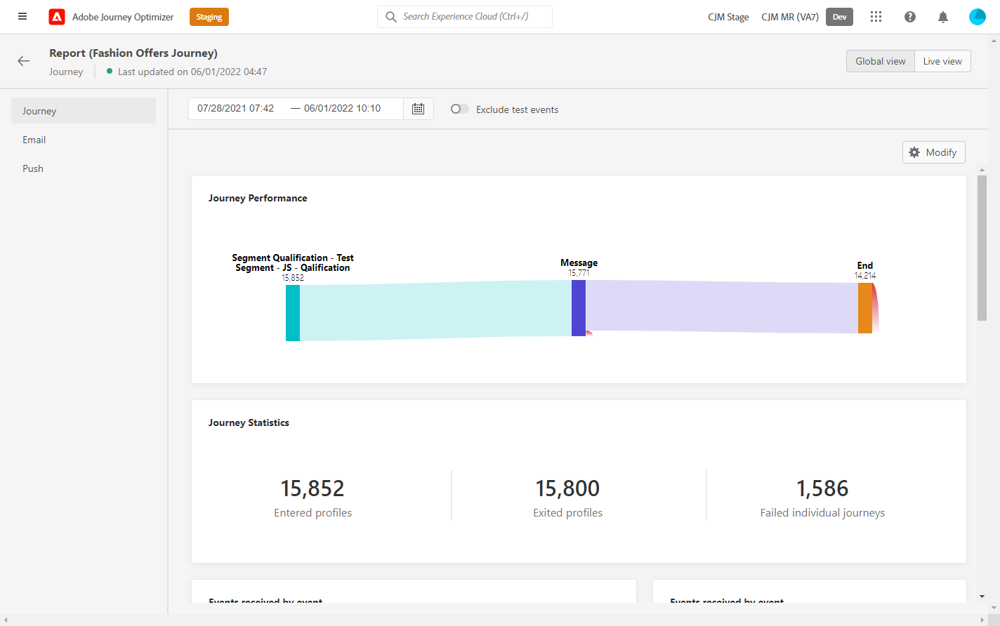

# Upgrade your Journey Orchestration environment to Adobe Journey Optimizer{#ugrade-ajo}

## What is Adobe Journey Optimizer?

Adobe Journey Optimizer is an agile and scalable application built natively on the Adobe Experience Platform for orchestrating and delivering personalized, connected, and timely customer journeys across any app, device, screen, or channel.​

## What is Journey Orchestration?

Journey Orchestration is a service built on Adobe Experience Platform that allows you tailor individual journeys for each customer based on their previous behavior and preferences. Journey Orchestration is the precursor application to Journey Optimizer. 

## Why should I move to Adobe Journey Optimizer?

**Access to a streamlined interface** with Experience Platform capabilities giving quick access to journeys, datasets, profiles, alerting and more. No need to do back and forth between Adobe Experience Platform and Journey Orchestration anymore to access schemas or datasets, everything is directly available from Adobe Journey Optimizer. For more information, refer to this [page](https://experienceleague.adobe.com/docs/journey-optimizer/using/get-started/user-interface.html).

<table>
<tr>
<th>Before</th>
<th>After</th>
</tr>
<tr>
<td>
Access to Journeys, Segments and Admin section (data sources, events and actions) in Journey Orchestration. Segments and datasets are accessible in Adobe Experience Platform. 
</td>
<td>
Access to Journeys, Segments, Admin, Segments and Datasets, <strong>all within Adobe Journey Optimizer</strong>. <strong>Additional Adobe Experience Platform capabilities</strong> are also accessible here.
</td>
</tr>
</table>

**New Reporting interface** and access to new reporting features:

<table>
<tr>
<th>Before</th>
<th>After</th>
</tr>
<tr>
<td></td>
<td>
<strong>Global view</strong> allows you to measure the impact of your journeys & deliveries over a selected time period. For more real-time metrics, you can access the <strong>Live view</strong>. For each delivery channels being used in your journeys (Email, SMS, Push), a <strong>dedicated section</strong> is available in the report to view metrics. This applies only if you use out-of-the-box <strong>Adobe Journey Optimizer messaging capabilities</strong>. Please reach out to your account team for more information.
</td>
</tr>
</table>

Any evolution to improve the reporting experience or to enrich it following new feature releases is only available on the new reporting interface. Start using it to get a more complete Adobe Journey Optimizer experience.

Get the benefit of other current **Adobe Journey Optimizer features** and new ones coming out such as Field Level Access Control and Object Level Access Control. Please reach out to your account team to get more information.

## How to upgrade my Journey Orchestration environment?

1. Reach out to your account team to update your agreement with Adobe at no cost. 

1. Wait for our Engineering team to complete the change. 

1. Update your permissions by using Journey Optimizer's product profiles. Refer to this [page](  https://experienceleague.adobe.com/docs/journey-optimizer/using/administration/ootb-product-profiles.html).

1. You now have access to Adobe Journey Optimizer!

## Frequently Asked Questions

### Do I need to plan anything to move from Journey Orchestration to Adobe Journey Optimizer?

No, there is no migration, no work needed from you, no downtime and no additional investment. You only need to update your agreement with Adobe and we do the rest. Please contact your account representative for instructions on how to initiate this process. 

### Will I lose something after the change?

No, you will keep all your existing Journey Orchestration and Adobe Experience Platform objects: schemas, datasets, journeys, events, data sources, actions. Nothing will be lost, all live journeys will continue to work with no interruption.

<table>
<tr>
<th>Before</th>
<th>After</th>
</tr>
<tr>
<td></td>
<td></td>
</tr>
</table>

### I still see Journey Orchestration in the application switcher, is it normal?

Yes, it is normal. You will keep the access to Journey Orchestration for one month following the upgrade. This will give you enough time to update all your users permissions and get more familiar with Adobe Journey Optimizer. After one month, the access will be removed.

### What happens if I use Journey Orchestration with Adobe Campaign Standard today?

By moving to Adobe Journey Optimizer, you will still be able to use the integration between Journeys and Adobe Campaign Standard by designing your customer journey in Adobe Journey Optimizer and letting Adobe Campaign Standard send the delivery.

However, due to how Adobe Journey Optimizer reporting stack works, reporting will not combine Journey and Campaign Standard data. Journey information will be available in Adobe Journey Optimizer reports and delivery information in Adobe Campaign Standard. A configuration of Experience Platform can be made to bring back Adobe Campaign Standard data into Adobe Experience Platform, making it  available to Customer Journey Analytics ([learn more](https://business.adobe.com/products/experience-platform/customer-journey-analytics.html)) or other third party reporting tools such as Tableau or PowerBI.

Adobe Journey Optimizer reports best operate when using Adobe Journey Optimizer's out-of-the-box messaging capabilities (available in dedicated Adobe Journey Optimizer offerings). For more information on how Messages can be authored in the journey canvas, refer to this [page](https://experienceleague.adobe.com/docs/journey-optimizer/using/messages/messages-in-journeys.html).

Please reach out to your account team for more information.