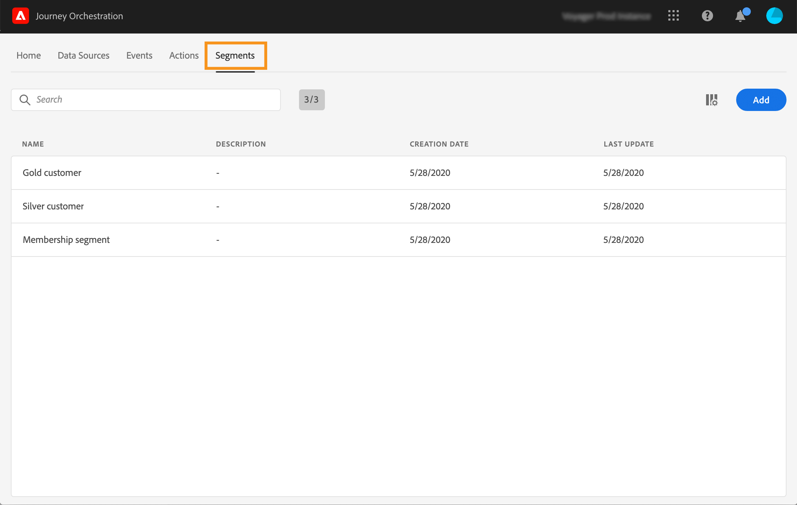
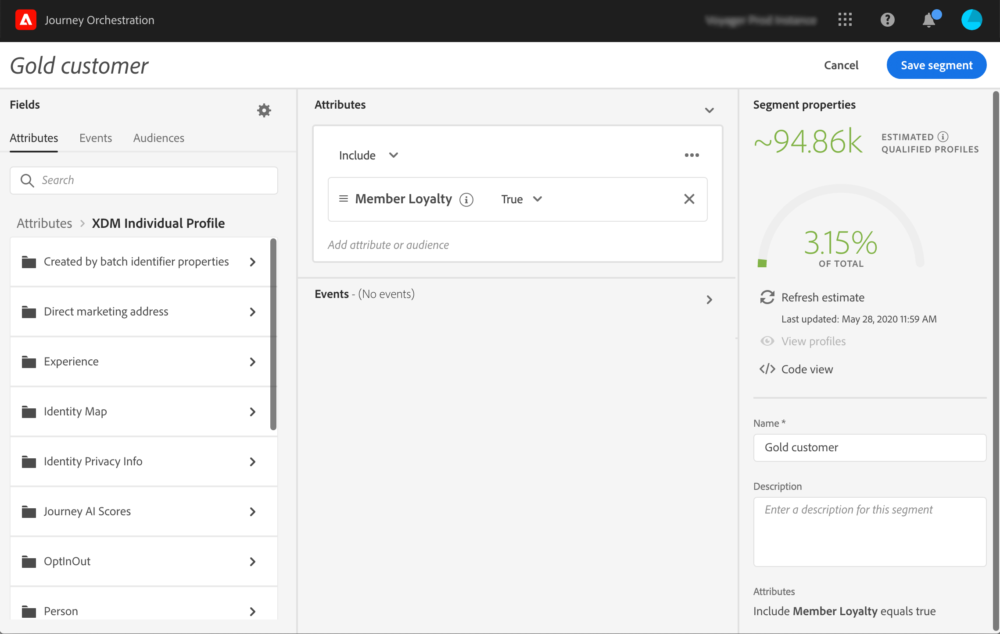

# Creating a segment {#creating-a-segment}

>[!CAUTION]
>
>**Looking for Adobe Journey Optimizer**? Click [here](https://experienceleague.adobe.com/en/docs/journey-optimizer/using/ajo-home){target="_blank"} for Journey Optimizer documentation.
>
>
>_This documentation refers to legacy Journey Orchestration materials which has been replaced by Journey Optimizer. Please contact your account team if you have questions about your access to Journey Orchestration or Journey Optimizer._

You can either create a segment using the [Adobe Experience Platform Segmentation Service](https://experienceleague.adobe.com/docs/experience-platform/segmentation/home.html) or you can access and create them directly in [!DNL Journey Orchestration].

1. In the top menu, click on the **[!UICONTROL Segments]** tab. The list of Adobe Experience Platform segments is displayed. You can search for a specific segment in the list.

   

1. Click **[!UICONTROL Add]** to create a new segment. The segment definition screen allows you to configure all the required fields to define your segment. The configuration is the same as in the Segmentation Service. Refer to the [Segment Builder user guide](https://experienceleague.adobe.com/docs/experience-platform/segmentation/ui/overview.html).

   

Your segment can now be used in your journeys to build conditions or add a **[!UICONTROL Segment qualification]** event. See [Using segments in conditions](../segment/using-a-segment.md) and [Events activities](../building-journeys/segment-qualification-events.md).
