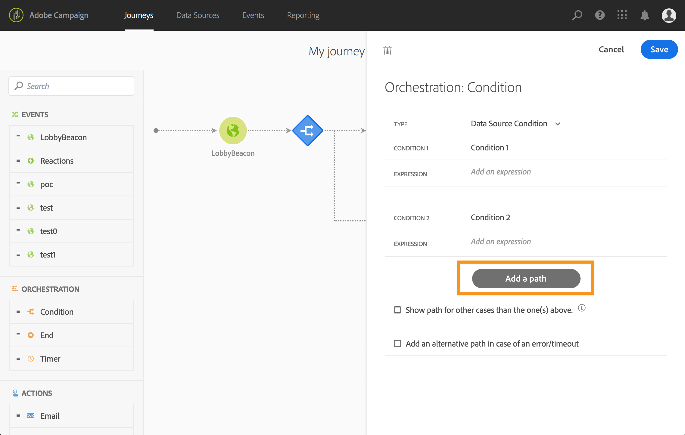

# Using segments in conditions {#using-a-segment}

This section explains how to use a segment in a journey condition. To learn how to use a **[!UICONTROL Segment qualification]** event in your journey, refer to this [section](../building-journeys/segment-qualification-events.md).

To use a segment in a journey condition, follow these steps:

1. Open a journey, drop a **[!UICONTROL Condition]** activity and choose the **Data Source Condition**.
   

1. Click **[!UICONTROL Add a path]** for each extra path needed. For each path, click the **[!UICONTROL Expression]** field.

   

1. On the left side, unfold **[!UICONTROL Segments]** node. Drag and drop the segment you want to use for your condition. By default, the condition on the segment is true.

   

   >[!NOTE]
   >
   >Only the individuals with the **Realized** and **Existing** segment participation statuses will be considered as members of the segment. For more on how to evaluate a segment, refer to the [Segmentation Service documentation](https://experienceleague.adobe.com/docs/experience-platform/segmentation/tutorials/evaluate-a-segment.html?lang=en#interpret-segment-results). 

For more information on journey conditions and how to use the simple expression editor, refer to [Condition activity](../building-journeys/condition-activity.md#about_condition).
