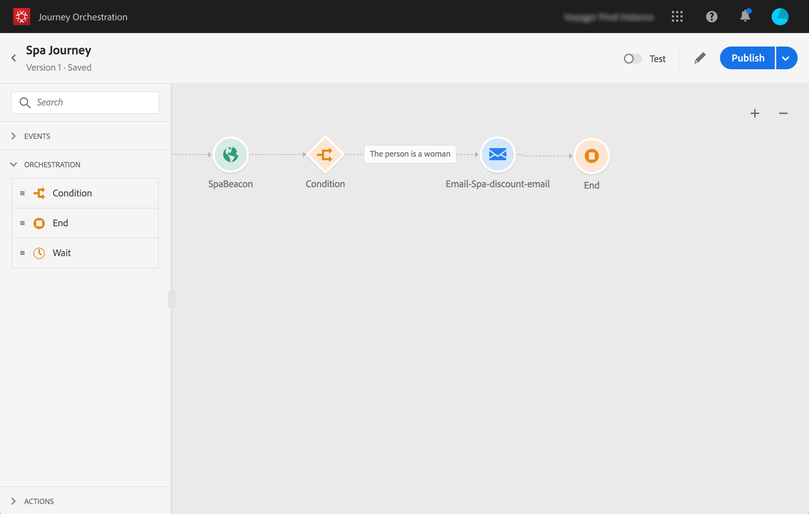

# About the simple use case{#concept_grh_vby_w2b}

## Purpose {#purpose}

Let's take the example of a hotel brand named Marlton. In their hotels, they have positioned beacon devices near all the strategic areas: lobby, floors, restaurant, gym, pool, etc.

In this use case, we will see how to send a personalized message in real-time to a person walking next to a beacon positioned near the spa.

We want to send a message only if the person is a woman. The message must be received within seconds.

## Pre-requisites {#prerequisites}

For our use case, we have designed one email transactional messaging template in Adobe Campaign Standard. We are using an event transactional messaging template. Refer to this [page](https://docs.adobe.com/content/help/en/campaign-standard/using/communication-channels/transactional-messaging/about-transactional-messaging.html).

Adobe Campaign Standard is configured to send emails.

Events are sent from the customers' mobile phone when they are detected near a beacon. You need to design a mobile application to send events from the customer's mobile phone to the Mobile SDK.
