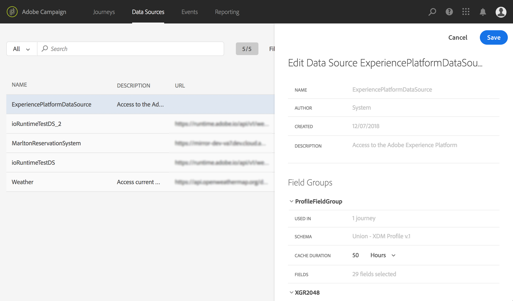

# Configuring the data source{#concept_ax3_bcy_w2b}

In our use case, we want to use personalization data for our messages. We also need to check is the person is a woman. This information is stored in the Real-time Customer Profile database. The **technical user** needs to check that those fields are defined in the built-in Adobe Experience Platform data source.

For additional information on data source configuration, refer to [this page](../datasource/about-data-sources.md). 

1. In the top menu, click the **[!UICONTROL Data Sources]** tab and select the build-in Adobe Experience Platform data source.

    

1. In the field groups, check that the following fields are selected:

    * _person > name > firstName_
    * _person > name > lastName_
    * _person > gender_
    * _personalEmail > address_

1. Click **[!UICONTROL Save]**.

The data source is now configured and ready to be used in your journey.
