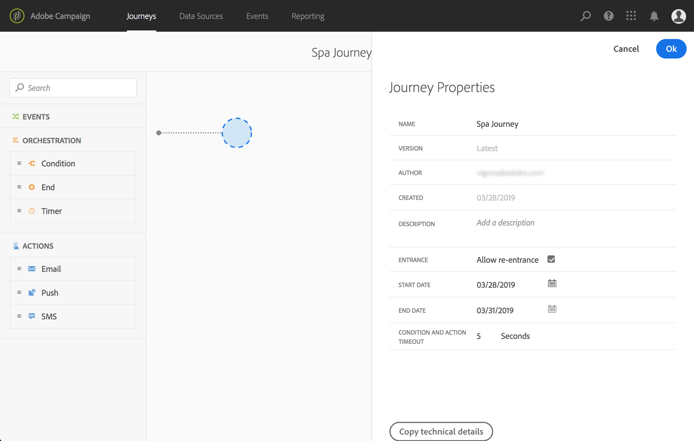
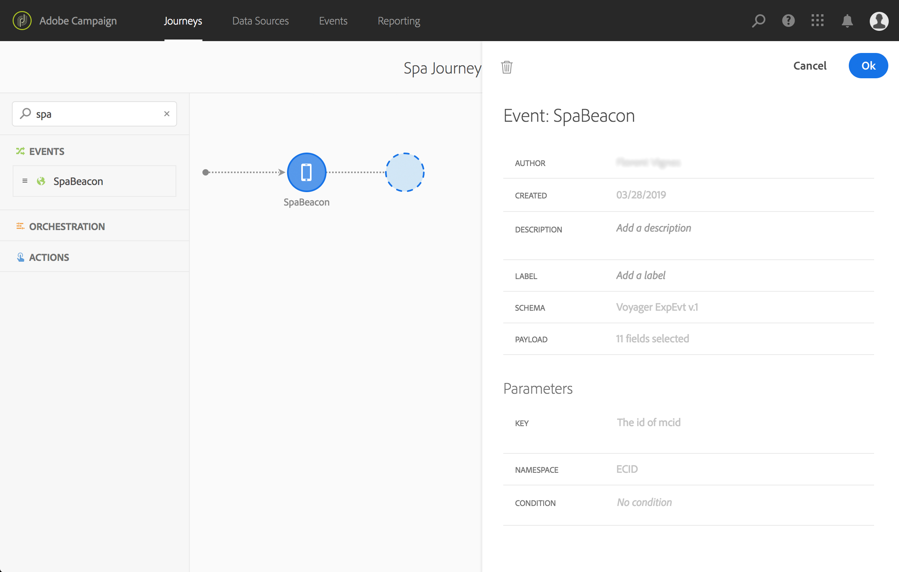
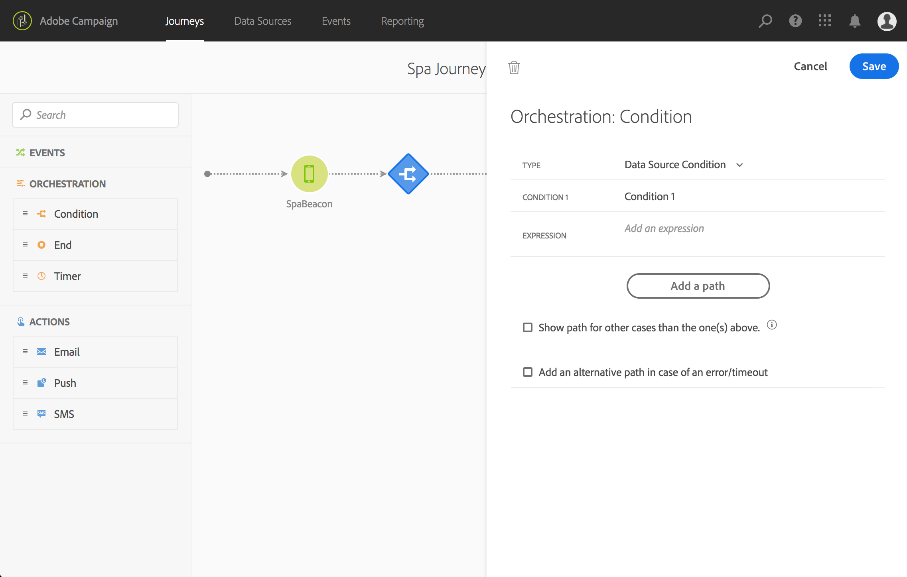
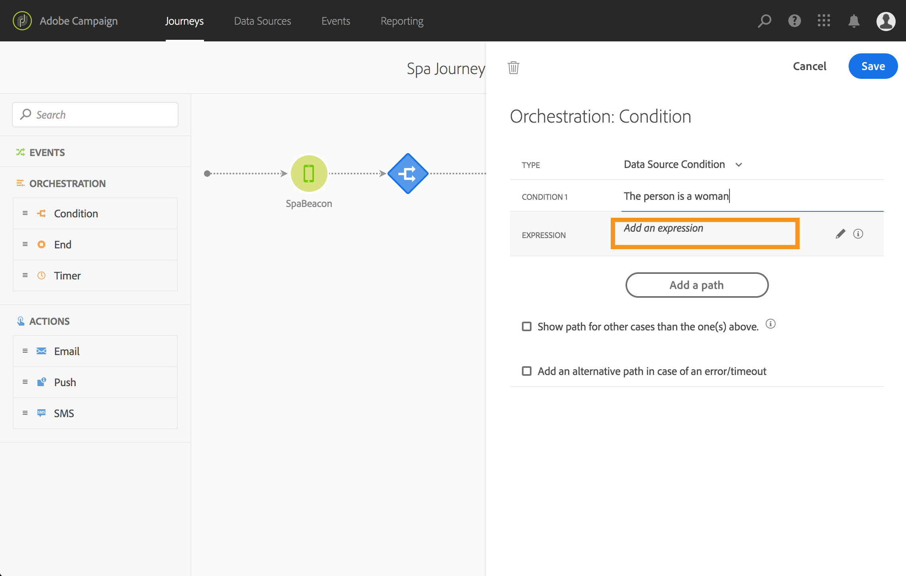
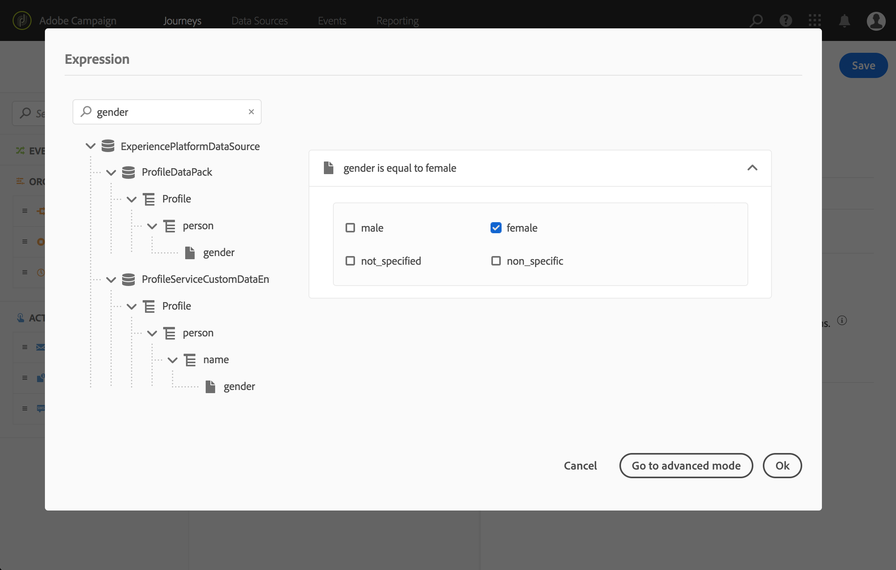
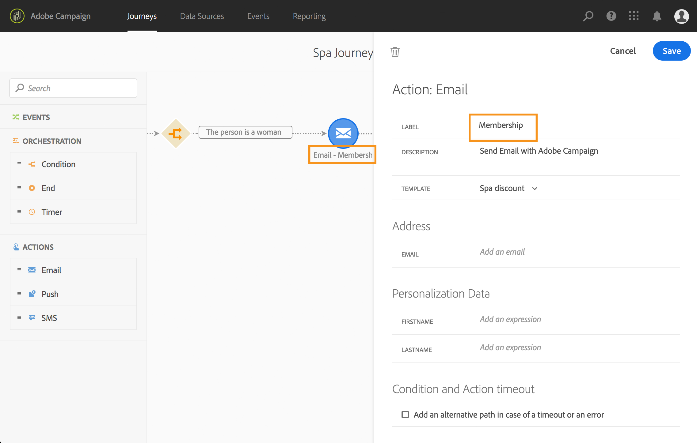
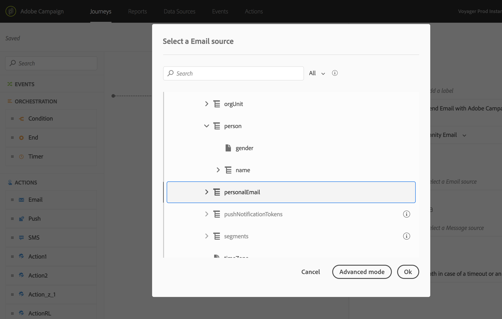
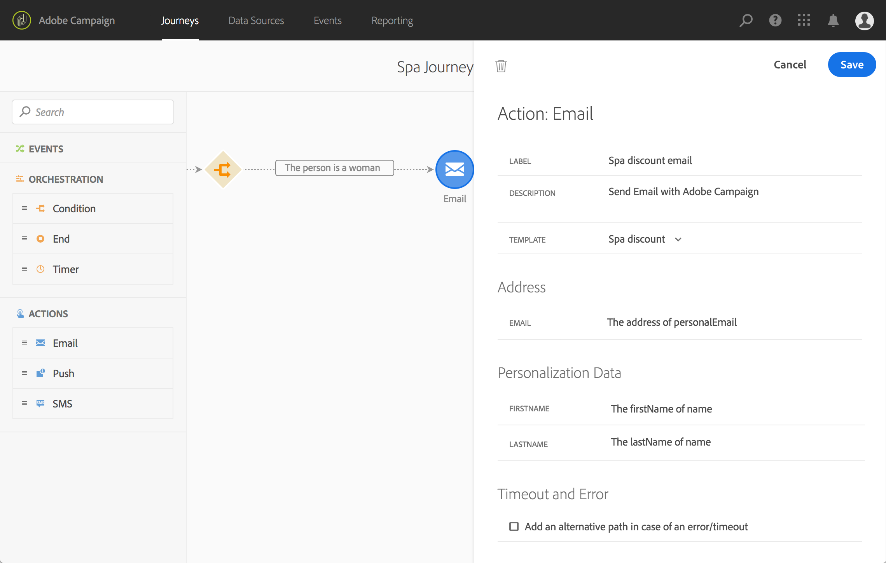
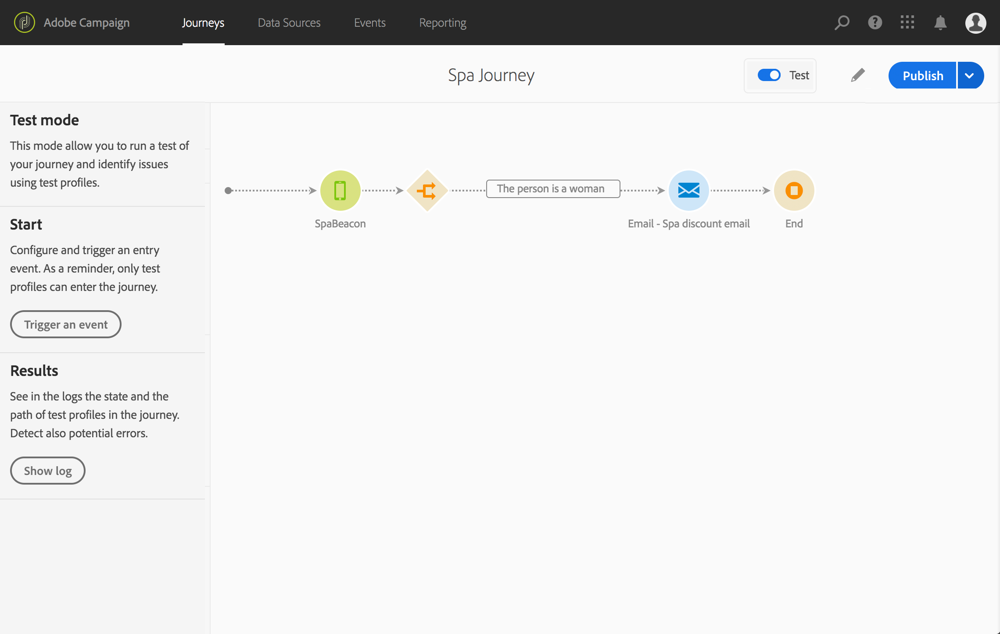
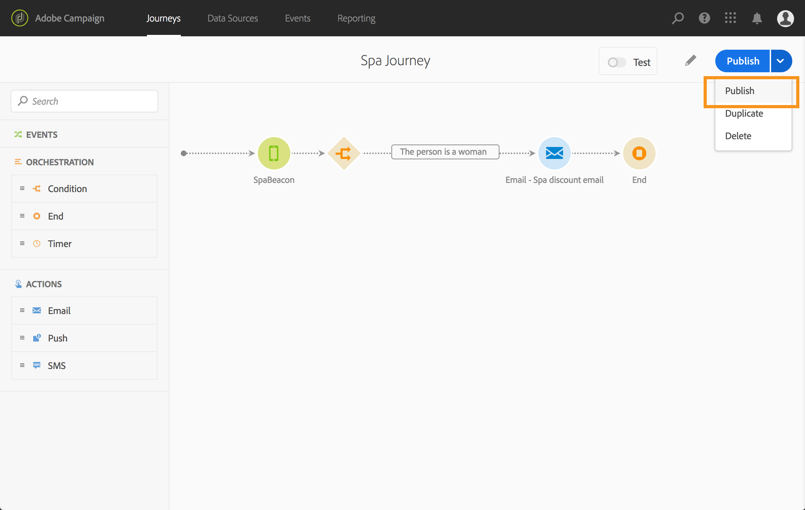

# Building the journey{#concept_eyw_mcy_w2b}

>[!CAUTION]
>
>**Looking for Adobe Journey Optimizer**? Click [here](https://experienceleague.adobe.com/en/docs/journey-optimizer/using/ajo-home){target="_blank"} for Journey Optimizer documentation.
>
>
>_This documentation refers to legacy Journey Orchestration materials which has been replaced by Journey Optimizer. Please contact your account team if you have questions about your access to Journey Orchestration or Journey Optimizer._

The **business user** can now build the journey. Our journey will only include one path with the following activities:

* the "SpaBeacon" **[!UICONTROL Event]**: when a person walks near the spa beacon, the system will receive an event and the journey will start for that person.
* a **[!UICONTROL Condition]** activity to check that the person is a woman
* an **[!UICONTROL Email]** activity (using Adobe Campaign Standard)
* an **[!UICONTROL End]** activity

>[!NOTE]
>
>The **[!UICONTROL Push]** and **[!UICONTROL Email]** activities are only available in the palette if you have Adobe Campaign Standard.

For additional information on how to build a journey, refer to [this page](../building-journeys/journey.md).

1. In the top menu, click the **[!UICONTROL Home]** tab and **[!UICONTROL Create]** to create a new journey.

    

1. Edit the journey's properties in the configuration pane displayed on the right side. We name it "Spa journey" and set it to last for one month, from the 1st to the 31st of December.

    

1. Start designing your journey by drag and dropping the "SpaBeacon" event from the palette to the canvas. You can also double-click on the event in the palette to add it to the canvas.

    

1. Let's now add a condition to check that the person is a woman. Drag and drop a condition activity into your journey.

    

1. Choose the **[!UICONTROL Data Source Condition]** type and click in the **[!UICONTROL Expression]** field. You can also define a condition label that will appear on the arrow, in the canvas.

    

1. Using the simple expression editor, look for the gender field (_person > gender_) and drop it to the right to create the following condition: "gender is equal to "Female".

    

1. Drop an **[!UICONTROL Email]** activity and select your "Spa discount" transactional messaging template. This template was designed using Adobe Campaign. Refer to this [page](https://experienceleague.adobe.com/docs/campaign-standard/using/communication-channels/transactional-messaging/getting-started-with-transactional-msg.html).

    

1. Click inside the **[!UICONTROL Email]** field and select the email address from the data source.

    

1. In the same way, define the first name and last name personalization fields from the data source.

    

1. Drop an **[!UICONTROL End]** activity.

    

1. Click on the **[!UICONTROL Test]** toggle and test your journey using test profiles. If there is any error, deactivate the test mode, modify your journey and test it again. For more information on the test mode, refer to [this page](../building-journeys/testing-the-journey.md). 

    

1. When the test is conclusive, you can publish your journey from the top right drop-down menu.

    

Next time a woman walks near the spa beacon, she will immediately receive a "Spa discount" personalized email.
