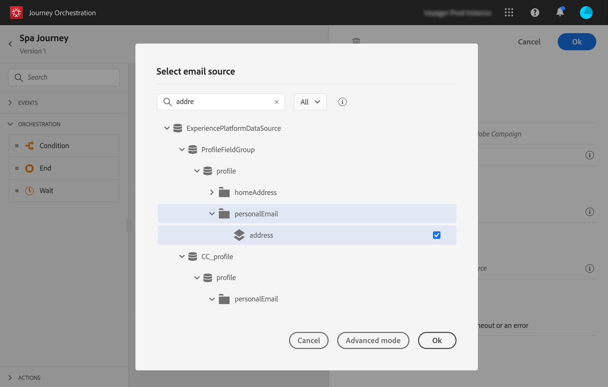

# Building the journey {#concept_eyw_mcy_w2b}

The **business user** can now build the journey. Our journey will only include one path with the following activities:

* the "SpaBeacon" **event**: when a person walks near the spa beacon, the system will receive an event and the journey will start for that person.
* a **Condition** activity to check that the person is a woman
* an **Email** activity
* an **End** activity

For additional information on how to build a journey, refer to [Building a journey](../journey/journey.md#concept_gq5_sqt_52b).

1. In the top bar, click **Journeys** and **Create** to create a new journey.

    

1. Edit the journey's properties by clicking on the pencil icon. We name it "Spa journey" and set it to last for one month, from the 1st to the 30th of September.

    

1. Start designing your journey by drag and dropping the "SpaBeacon" event from the palette to the canvas. 

    

1. Let's now add a condition to check that the person is a woman. Drag and drop a condition activity into your journey.

    

1. Choose the **Data Source Condition** type and click in the **Expression** field. 

    

1. Using the basic expression editor, look for the gender field (_person > gender_) and drop it to the right to create the following condition: "gender is equal to "Female".

    

1. Drop an **Email** activity and select your "Spa discount" transactional messaging template. This template was designed using Adobe Campaign. Refer to this [page](https://docs.adobe.com/content/help/en/campaign-standard/using/communication-channels/transactional-messaging/about-transactional-messaging.html).

    

1. Click inside the **Email** field and select the email address from the data source.

    

1. In the same way, define the first name and last name personalization fields from the data source.

    

1. Drop an **End** activity.

    

1. Test your journey. If there is any error, deactivate the test mode, modify your journey and test it again. When the test is conclusive, you can publish your journey from the top right drop-down menu.

    

Next time a woman walks near the spa beacon, she will immediately receive a "Spa discount" personalized email.
